# CLAUDE.md - StartupSniff Development Guide

**StartupSniff**: AI-powered startup idea discovery and validation platform built with Next.js 15, Supabase, and modern web technologies.

## 🎯 Product Overview

### Mission Statement
Empower entrepreneurs to discover trending startup opportunities through AI-powered idea generation, comprehensive market validation, and Reddit trend analysis.

### Core Value Propositions
- **AI-Powered Idea Generation**: Transform market trends and user input into viable startup concepts
- **Market Validation Engine**: Research and validate ideas with comprehensive analysis
- **Reddit Trend Mining**: Extract insights from entrepreneurial communities and market discussions  
- **Content Generation Suite**: Create marketing materials, blog posts, and promotional content
- **Usage Analytics**: Track idea generation, validation progress, and user engagement

### Target Market
- **Primary**: Aspiring entrepreneurs seeking data-driven startup ideas
- **Secondary**: Growth hackers researching market opportunities
- **Tertiary**: Business consultants and startup accelerators

## 🏗️ StartupSniff Architecture

### Application Structure
```
startup-sniff/
├── app/                           # Next.js 15.5.2 App Router
│   ├── (dashboard)/               # Protected dashboard routes  
│   │   ├── dashboard/
│   │   │   ├── page.tsx           # Main dashboard overview
│   │   │   ├── generate/          # AI idea generation
│   │   │   ├── ideas/             # Saved ideas management
│   │   │   ├── validation/        # Market validation tools
│   │   │   ├── trends/            # Reddit trend analysis
│   │   │   ├── content/           # Content generation
│   │   │   └── billing/           # Subscription management
│   │   └── layout.tsx             # Dashboard shell with sidebar
│   ├── auth/                      # Authentication flows
│   │   ├── signin/                # Sign in page
│   │   ├── signup/                # Sign up page  
│   │   ├── forgot-password/       # Password reset request
│   │   ├── reset-password/        # Password reset form
│   │   └── callback/              # OAuth/email confirmation
│   ├── api/                       # API routes
│   │   └── webhooks/stripe/       # Stripe webhook handler
│   ├── page.tsx                   # Landing page
│   ├── layout.tsx                 # Root layout
│   └── globals.css                # Tailwind v4 + CSS variables
├── components/
│   ├── ui/                        # shadcn/ui components
│   ├── auth/                      # Authentication components
│   └── features/                  # Feature-specific components
│       ├── dashboard/             # Dashboard-related UI
│       └── billing/               # Subscription/billing UI
├── lib/
│   ├── auth/                      # Authentication utilities
│   ├── supabase/                  # Database clients
│   └── utils.ts                   # Common utilities
├── server/                        # Server-only code (planned)
├── constants/                     # Application constants
├── types/
│   ├── supabase.ts                # Generated Supabase types
│   └── global.ts                  # Application types
├── database-setup.sql             # Complete database schema
└── supabase/                      # Supabase configuration
    ├── migrations/                # Database migrations
    └── config.toml                # Local development config
```

### Core Database Schema

```sql
-- Main Entity Relationships
users (id, email, plan_type, stripe_customer_id)
├── subscriptions (stripe data, billing cycles)
├── usage_limits (plan quotas, monthly resets)
├── startup_ideas (AI-generated concepts with validation)
└── generated_content (marketing materials, blog posts)

-- Key JSONB Data Structures
startup_ideas.target_market = {
  "demographic": "string",
  "size": "number", 
  "pain_level": "high|medium|low"
}

startup_ideas.solution = {
  "value_proposition": "string",
  "features": ["string"],
  "business_model": "string"
}
```

### Pricing & Plan Structure

| Plan | Price | Ideas/Month | Validations/Month | Key Features |
|------|-------|-------------|-------------------|---------------|
| **Explorer** | Free | 3 | 1 | Basic Reddit analysis, Standard content |
| **Founder** | $19 | 25 | 10 | Advanced analysis, PDF export, Priority support |
| **Growth** | $49 | Unlimited | Unlimited | Multi-platform trends, API access, Consultation |

## 🚀 Core Development Principles

### 1. Type Generation is Non-Negotiable

```bash
# After ANY schema change:
supabase gen types --local > types/supabase.ts

# Automate with git hooks:
# .husky/pre-commit
if git diff --cached --name-only | grep -q "supabase/migrations"; then
  npm run types:generate
  git add types/supabase.ts
fi
```

### 2. Server-First Architecture (Next.js 15.5.2)

```typescript
// 🔒 Server Components by default
export default async function Page() {
  const data = await getServerData() // Direct DB calls
  return <ClientComponent initialData={data} />
}

// 🔒 Use after() for non-blocking operations
import { after } from 'next/server'

export async function createPost(data: PostInput) {
  const post = await db.posts.create(data)

  after(async () => {
    // Non-blocking: analytics, cache warming, webhooks
    await trackEvent('post_created', { postId: post.id })
    await sendNotification(post.authorId)
  })

  return post
}
```

### 3. Supabase Client Separation

```typescript
// lib/supabase/client.ts - Browser only
import { createBrowserClient } from '@supabase/ssr'
import type { Database } from '@/types/supabase'

export const createClient = () =>
  createBrowserClient<Database>(
    process.env.NEXT_PUBLIC_SUPABASE_URL!,
    process.env.NEXT_PUBLIC_SUPABASE_ANON_KEY!
  )

// lib/supabase/server.ts - Server only
import { createServerClient } from '@supabase/ssr'
import { cookies } from 'next/headers'

export const createClient = async () => {
  const cookieStore = await cookies()
  return createServerClient<Database>(
    process.env.NEXT_PUBLIC_SUPABASE_URL!,
    process.env.NEXT_PUBLIC_SUPABASE_ANON_KEY!,
    {
      cookies: {
        getAll: () => cookieStore.getAll(),
        setAll: (cookiesToSet) => {
          cookiesToSet.forEach(({ name, value, options }) =>
            cookieStore.set(name, value, options)
          )
        },
      },
    }
  )
}
```

### 4. StartupSniff Data Architecture

#### Domain-Driven Database Design

**Core Entities & Relationships**:
```sql
-- User Management Domain
USERS (auth.users extension)
  ├── SUBSCRIPTIONS (Stripe integration)
  └── USAGE_LIMITS (plan quotas)

-- Idea Generation Domain  
STARTUP_IDEAS (AI-generated concepts)
  ├── target_market: JSONB (demographics, size, pain_level)
  ├── solution: JSONB (value_prop, features, business_model)
  ├── market_analysis: JSONB (competition, timing, barriers)
  ├── implementation: JSONB (complexity, mvp, timeline)
  ├── success_metrics: JSONB (probability, risk_factors)
  └── ai_confidence_score: INTEGER (0-100)

-- Content Generation Domain
GENERATED_CONTENT (marketing materials)
  ├── content_type: ENUM (blog_post, tweet, email, landing_page)
  ├── brand_voice: TEXT (technical, growth_hacker, storyteller)
  └── seo_keywords: TEXT[]
```

#### Migration-First Development Rules

1. **NEVER modify database directly** - All changes via migrations
2. **StartupSniff migration naming**:
    ```bash
    # Feature-based naming
    supabase migration new add_idea_validation_features
    supabase migration new update_usage_limits_growth_plan
    supabase migration new create_content_generation_indexes
    ```
3. **Required migration components**:
    ```sql
    -- Enable RLS (Row Level Security)
    ALTER TABLE table_name ENABLE ROW LEVEL SECURITY;
    
    -- Add user-scoped policies
    CREATE POLICY "policy_name" ON table_name 
        FOR SELECT USING (auth.uid() = user_id);
    
    -- Performance indexes
    CREATE INDEX idx_table_user_created ON table_name(user_id, created_at DESC);
    
    -- Updated timestamp triggers
    CREATE TRIGGER update_table_updated_at 
        BEFORE UPDATE ON table_name 
        FOR EACH ROW EXECUTE FUNCTION update_updated_at_column();
    ```
4. **Post-migration workflow**:
    ```bash
    supabase db reset                                    # Apply locally
    npm run db:types                                     # Generate types
    npm run lint && npm run typecheck                    # Validate code
    git add types/supabase.ts && git commit -m "types: update after [migration]"  # Commit types
    ```

---

## 🎨 StartupSniff Feature Modules

### Feature-Based Component Architecture

```typescript
// components/features/[domain]/

// Dashboard Domain
components/features/dashboard/
├── dashboard-shell.tsx          # Main layout wrapper
├── sidebar.tsx                  # Navigation sidebar  
├── top-bar.tsx                  # Header with user menu
├── stats-cards.tsx              # Usage statistics display
├── recent-ideas.tsx             # Latest generated ideas
├── usage-limits.tsx             # Plan limits & progress
├── quick-actions.tsx            # CTA buttons
├── idea-generation-form.tsx     # AI prompt interface
└── idea-card.tsx                # Idea display component

// Billing Domain
components/features/billing/
├── pricing-cards.tsx            # Plan comparison
├── current-plan.tsx             # Active subscription info
└── billing-history.tsx          # Transaction history

// Authentication Domain (secure patterns)
components/auth/
├── signin-form.tsx              # Login with CSRF protection
├── signup-form.tsx              # Registration with validation
├── forgot-password-form.tsx     # Reset request form
└── reset-password-form.tsx      # Token-based password reset
```

### StartupSniff Constants & Configuration

```typescript
// constants/index.ts - Application constants
export const PRICING_PLANS = [
  { id: 'explorer', price: 0, limits: { ideas: 3, validations: 1 } },
  { id: 'founder', price: 19, limits: { ideas: 25, validations: 10 } },
  { id: 'growth', price: 49, limits: { ideas: -1, validations: -1 } }
]

export const CONTENT_TYPES = [
  'blog_post', 'tweet', 'email', 'landing_page'
]

export const BRAND_VOICES = [
  'technical', 'growth_hacker', 'storyteller', 'educator', 'contrarian'
]

export const SUBREDDITS = [
  'entrepreneur', 'startups', 'SaaS', 'digitalnomad', 'sidehustle'
]

export const API_LIMITS = {
  RATE_LIMIT: {
    explorer: { requests: 10, window: 60 * 1000 },
    founder: { requests: 50, window: 60 * 1000 },
    growth: { requests: 200, window: 60 * 1000 }
  }
}
```

---

## 🎨 UI Components (shadcn/ui + Tailwind v4)

### StartupSniff Design System (Updated)

```css
/* app/globals.css - Design System v1.0.0 */
:root {
  /* Brand Colors */
  --color-brand-primary: #2563EB;        /* Blue - Main brand */
  --color-brand-secondary: #1E293B;      /* Dark slate - Secondary brand */
  
  /* Background Colors */
  --color-background-default: #F8FAFC;   /* Default background */
  --color-background-alt: #FFFFFF;       /* Alternative background */
  
  /* Text Colors */
  --color-text-primary: #1E293B;         /* Main text */
  --color-text-secondary: #475569;       /* Secondary text */
  
  /* Utility Colors */
  --color-border: #E2E8F0;               /* Borders */
  --color-success: #22C55E;              /* Success states */
  --color-warning: #FACC15;              /* Warning states */
  --color-error: #EF4444;                /* Error states */

  /* Tailwind CSS Variables */
  --primary: #2563EB;
  --secondary: #1E293B;
  --background: #F8FAFC;
  --background-alt: #FFFFFF;
  --border: #E2E8F0;
  --success: #22C55E;
  --warning: #FACC15;
  --error: #EF4444;
  
  /* Typography */
  --font-family-base: 'Inter', 'Segoe UI', sans-serif;
  --font-size-sm: 12px;
  --font-size-md: 16px;
  --font-size-lg: 20px;
  --font-weight-normal: 400;
  --font-weight-bold: 700;
  --line-height-base: 1.6;
  
  /* Spacing */
  --spacing-xs: 4px;
  --spacing-sm: 8px;
  --spacing-md: 16px;
  --spacing-lg: 24px;
  --spacing-xl: 32px;
  
  /* Border Radius */
  --radius-xs: 2px;
  --radius-sm: 4px;
  --radius-md: 8px;
  --radius-lg: 16px;
  
  /* Shadows */
  --shadow-xs: 0 1px 2px rgba(0,0,0,0.05);
  --shadow-sm: 0 2px 8px rgba(0,0,0,0.08);
  --shadow-md: 0 4px 20px rgba(0,0,0,0.12);
}

/* Dark Theme */
.dark {
  --color-brand-primary: #3B82F6;        /* Lighter blue for dark */
  --color-brand-secondary: #E2E8F0;      /* Light text for secondary */
  
  --color-background-default: #1E293B;   /* Dark background */
  --color-background-alt: #334155;       /* Dark alternative background */
  
  --color-text-primary: #F8FAFC;         /* Light text */
  --color-text-secondary: #CBD5E1;       /* Secondary light text */
  
  --color-border: #475569;               /* Dark borders */
  
  /* Update Tailwind variables for dark mode */
  --primary: #3B82F6;
  --secondary: #E2E8F0;
  --background: #1E293B;
  --background-alt: #334155;
  --border: #475569;
}
```

### Design Token Integration

```typescript
// styles/design-tokens.json - Complete Design System
{
  "name": "StartupSniff Design System",
  "version": "1.0.0",
  "tokens": {
    "color": {
      "brand-primary": { "value": "#2563EB", "type": "color" },
      "brand-secondary": { "value": "#1E293B", "type": "color" },
      "background-default": { "value": "#F8FAFC", "type": "color" },
      "background-alt": { "value": "#FFFFFF", "type": "color" },
      "text-primary": { "value": "#1E293B", "type": "color" },
      "text-secondary": { "value": "#475569", "type": "color" },
      "border": { "value": "#E2E8F0", "type": "color" },
      "success": { "value": "#22C55E", "type": "color" },
      "warning": { "value": "#FACC15", "type": "color" },
      "error": { "value": "#EF4444", "type": "color" }
    },
    "typography": {
      "font-family-base": { "value": "'Inter', 'Segoe UI', sans-serif", "type": "fontFamily" },
      "font-size-sm": { "value": "12px", "type": "dimension" },
      "font-size-md": { "value": "16px", "type": "dimension" },
      "font-size-lg": { "value": "20px", "type": "dimension" },
      "font-weight-normal": { "value": "400", "type": "fontWeight" },
      "font-weight-bold": { "value": "700", "type": "fontWeight" },
      "line-height-base": { "value": "1.6", "type": "lineHeight" }
    },
    "spacing": {
      "spacing-xs": { "value": "4px", "type": "dimension" },
      "spacing-sm": { "value": "8px", "type": "dimension" },
      "spacing-md": { "value": "16px", "type": "dimension" },
      "spacing-lg": { "value": "24px", "type": "dimension" },
      "spacing-xl": { "value": "32px", "type": "dimension" }
    },
    "border-radius": {
      "radius-xs": { "value": "2px", "type": "dimension" },
      "radius-sm": { "value": "4px", "type": "dimension" },
      "radius-md": { "value": "8px", "type": "dimension" },
      "radius-lg": { "value": "16px", "type": "dimension" }
    },
    "shadow": {
      "shadow-xs": { "value": "0 1px 2px rgba(0,0,0,0.05)", "type": "boxShadow" },
      "shadow-sm": { "value": "0 2px 8px rgba(0,0,0,0.08)", "type": "boxShadow" },
      "shadow-md": { "value": "0 4px 20px rgba(0,0,0,0.12)", "type": "boxShadow" }
    }
  }
}
```

### Shadcn/ui Setup & Integration

StartupSniff uses **shadcn/ui** exclusively for all UI components to ensure consistency, accessibility, and maintainability.

#### Core shadcn/ui Components Available

```bash
# Initialize shadcn/ui with Tailwind v4
npx shadcn@latest init

# Core UI Components (Already Added)
npx shadcn@latest add button form card toast dialog sheet
npx shadcn@latest add input label select textarea checkbox
npx shadcn@latest add dropdown-menu avatar badge separator
npx shadcn@latest add progress sidebar table tabs alert
npx shadcn@latest add navigation-menu tooltip skeleton
```

#### StartupSniff Component Architecture

```typescript
// ✅ ALWAYS use shadcn/ui components as building blocks
import { Card, CardContent, CardHeader, CardTitle } from '@/components/ui/card'
import { Button } from '@/components/ui/button'
import { Badge } from '@/components/ui/badge'

export function FeatureCard() {
  return (
    <Card>
      <CardHeader>
        <CardTitle>Feature Title</CardTitle>
      </CardHeader>
      <CardContent>
        <p>Feature description</p>
        <div className="flex gap-2 mt-4">
          <Button variant="default">Primary Action</Button>
          <Button variant="outline">Secondary</Button>
        </div>
        <Badge variant="secondary" className="mt-2">Status</Badge>
      </CardContent>
    </Card>
  )
}

// ❌ NEVER create custom styled divs when shadcn equivalent exists
function BadExample() {
  return (
    <div className="border rounded-lg p-4 shadow"> {/* Use Card instead */}
      <div className="font-semibold mb-2"> {/* Use CardTitle instead */}
        Title
      </div>
      <button className="bg-blue-500 hover:bg-blue-600 px-4 py-2 rounded"> {/* Use Button instead */}
        Click me
      </button>
    </div>
  )
}
```

#### Shadcn/ui Component Categories

**Layout & Structure**
- `Card` - Primary container for content sections
- `Separator` - Visual dividers between content
- `Sidebar` - Navigation sidebar (used in dashboard)

**Form Components**  
- `Button` - All interactive buttons
- `Input`, `Textarea` - Text input fields
- `Label` - Form field labels
- `Select` - Dropdown selections
- `Checkbox` - Boolean inputs
- `Form` - Form validation wrapper

**Navigation & Interaction**
- `DropdownMenu` - Context menus and user menus
- `NavigationMenu` - Primary navigation
- `Tabs` - Content organization
- `Dialog` - Modal overlays
- `Sheet` - Slide-out panels

**Feedback & Status**
- `Badge` - Status indicators and tags
- `Progress` - Loading and completion bars
- `Alert` - Important messages
- `Toast` - Notification system (Sonner)
- `Skeleton` - Loading states

**Data Display**
- `Table` - Structured data display
- `Avatar` - User profile images
- `Tooltip` - Additional information on hover

#### Component Composition Patterns

```typescript
// StartupSniff Dashboard Card Pattern
import { Card, CardContent, CardHeader, CardTitle } from '@/components/ui/card'
import { Badge } from '@/components/ui/badge'
import { Button } from '@/components/ui/button'
import { FeatureIcons } from '@/lib/icons'

interface DashboardCardProps {
  title: string
  description: string
  status: 'active' | 'pending' | 'completed'
  action?: () => void
}

export function DashboardCard({ title, description, status, action }: DashboardCardProps) {
  return (
    <Card className="hover:shadow-md transition-shadow">
      <CardHeader className="pb-3">
        <div className="flex items-start justify-between">
          <CardTitle className="text-lg">{title}</CardTitle>
          <Badge variant={status === 'active' ? 'default' : 'secondary'}>
            {status}
          </Badge>
        </div>
      </CardHeader>
      <CardContent>
        <p className="text-muted-foreground mb-4">{description}</p>
        {action && (
          <Button onClick={action} variant="outline" size="sm">
            <FeatureIcons.Forward className="w-4 h-4 mr-2" />
            Take Action
          </Button>
        )}
      </CardContent>
    </Card>
  )
}
```

#### Sidebar Implementation (StartupSniff Pattern)

```typescript
// components/features/dashboard/app-sidebar.tsx
import {
  Sidebar,
  SidebarContent,
  SidebarFooter,
  SidebarGroup,
  SidebarGroupContent,
  SidebarGroupLabel,
  SidebarHeader,
  SidebarMenu,
  SidebarMenuButton,
  SidebarMenuItem,
  SidebarProvider,
  SidebarRail,
} from '@/components/ui/sidebar'

export function AppSidebar() {
  return (
    <Sidebar collapsible="icon">
      <SidebarHeader>
        {/* Brand/Logo */}
      </SidebarHeader>
      
      <SidebarContent>
        <SidebarGroup>
          <SidebarGroupLabel>Platform</SidebarGroupLabel>
          <SidebarGroupContent>
            <SidebarMenu>
              {navigationItems.map((item) => (
                <SidebarMenuItem key={item.href}>
                  <SidebarMenuButton asChild isActive={pathname === item.href}>
                    <Link href={item.href}>
                      <item.icon />
                      <span>{item.title}</span>
                    </Link>
                  </SidebarMenuButton>
                </SidebarMenuItem>
              ))}
            </SidebarMenu>
          </SidebarGroupContent>
        </SidebarGroup>
      </SidebarContent>
      
      <SidebarFooter>
        {/* Footer content */}
      </SidebarFooter>
      
      <SidebarRail />
    </Sidebar>
  )
}

// Layout Integration
export function DashboardLayout({ children }: { children: React.ReactNode }) {
  return (
    <SidebarProvider>
      <AppSidebar />
      <SidebarInset>
        <header className="flex h-16 shrink-0 items-center gap-2 border-b px-4">
          <SidebarTrigger />
          {/* Header content */}
        </header>
        <div className="flex flex-1 flex-col gap-4 p-4">
          {children}
        </div>
      </SidebarInset>
    </SidebarProvider>
  )
}
```

### Icon System (Lucide React)

StartupSniff uses **Lucide React** as the exclusive icon library for consistency, performance, and accessibility.

#### Core Principles

```typescript
// ✅ ALWAYS use Lucide React icons
import { Lightbulb, TrendingUp, BarChart3, User, Settings } from 'lucide-react'

// ❌ NEVER use SVG files or other icon libraries
import Icon from './icon.svg' // DON'T DO THIS
```

#### Icon Categories & Usage

```typescript
// StartupSniff Icon Vocabulary
const STARTUPSNIFF_ICONS = {
  // Core Features
  idea_generation: ['Lightbulb', 'Sparkles', 'Zap'],
  market_validation: ['Target', 'BarChart3', 'TrendingUp'],
  content_creation: ['FileText', 'PenTool', 'Share2'],
  reddit_analysis: ['MessageCircle', 'Users', 'TrendingUp'],
  
  // Navigation & UI
  navigation: ['Home', 'Search', 'Bell', 'User', 'Settings'],
  actions: ['Plus', 'Edit', 'Trash2', 'Copy', 'Download'],
  states: ['Loader2', 'CheckCircle', 'AlertCircle', 'Eye', 'EyeOff'],
  
  // Business & Analytics
  billing: ['CreditCard', 'DollarSign', 'Calendar'],
  analytics: ['BarChart', 'PieChart', 'LineChart'],
  growth: ['TrendingUp', 'ArrowUp', 'Target'],
  
  // Social & Communication
  social: ['Heart', 'Share2', 'MessageCircle', 'ExternalLink'],
  communication: ['Mail', 'Phone', 'MessageSquare']
} as const
```

#### Icon Implementation Standards

```typescript
// Standard Icon Component Pattern
import { LucideIcon } from 'lucide-react'

interface IconButtonProps {
  icon: LucideIcon
  label: string
  variant?: 'default' | 'ghost' | 'outline'
  size?: 'sm' | 'md' | 'lg'
}

export function IconButton({ icon: Icon, label, variant = 'default', size = 'md' }: IconButtonProps) {
  const sizeClasses = {
    sm: 'h-4 w-4',
    md: 'h-5 w-5', 
    lg: 'h-6 w-6'
  }
  
  return (
    <Button variant={variant} size={size}>
      <Icon className={sizeClasses[size]} />
      <span className="ml-2">{label}</span>
    </Button>
  )
}

// Usage Examples
<IconButton icon={Lightbulb} label="Generate Ideas" />
<IconButton icon={TrendingUp} label="View Trends" variant="outline" />
<IconButton icon={BarChart3} label="Analytics" size="lg" />
```

#### Icon Sizing & Consistency

```css
/* Standard Icon Sizes */
.icon-xs { @apply h-3 w-3; }    /* 12px - Inline text */
.icon-sm { @apply h-4 w-4; }    /* 16px - Small buttons, badges */
.icon-md { @apply h-5 w-5; }    /* 20px - Default buttons, nav */
.icon-lg { @apply h-6 w-6; }    /* 24px - Headers, large buttons */
.icon-xl { @apply h-8 w-8; }    /* 32px - Feature highlights */
.icon-2xl { @apply h-12 w-12; } /* 48px - Hero sections */
```

#### Semantic Icon Usage

```typescript
// Feature-Specific Icon Mappings
export const FeatureIcons = {
  // Idea Generation
  IdeaGeneration: Lightbulb,
  AiGenerating: Sparkles,
  BrainStorming: Zap,
  
  // Market Validation  
  MarketResearch: Target,
  DataAnalysis: BarChart3,
  TrendAnalysis: TrendingUp,
  CompetitorAnalysis: Users,
  
  // Content Creation
  BlogPost: FileText,
  SocialContent: Share2,
  EmailCampaign: Mail,
  LandingPage: Layout,
  
  // Reddit Analysis
  RedditTrends: MessageCircle,
  CommunityInsights: Users,
  DiscussionAnalysis: MessageSquare,
  
  // User Interface
  Dashboard: LayoutDashboard,
  Profile: User,
  Settings: Settings,
  Notifications: Bell,
  Search: Search,
  
  // Actions
  Create: Plus,
  Edit: Edit,
  Delete: Trash2,
  Save: Save,
  Export: Download,
  Share: Share2,
  Copy: Copy,
  
  // States & Feedback
  Loading: Loader2,
  Success: CheckCircle,
  Warning: AlertTriangle,
  Error: AlertCircle,
  Info: Info,
  
  // Navigation
  Back: ArrowLeft,
  Forward: ArrowRight,
  Up: ArrowUp,
  Down: ArrowDown,
  External: ExternalLink,
  
  // Subscription & Billing
  Billing: CreditCard,
  Pricing: DollarSign,
  Calendar: Calendar,
  Plan: Zap,
  Upgrade: ArrowUp,
  
  // Visibility & Privacy
  Show: Eye,
  Hide: EyeOff,
  Public: Globe,
  Private: Lock,
  
  // Content Types
  Text: Type,
  Image: Image,
  Video: Video,
  File: FileText,
  Link: Link
} as const

// Usage in Components
import { FeatureIcons } from '@/lib/icons'

export function GenerateIdeasButton() {
  return (
    <Button>
      <FeatureIcons.IdeaGeneration className="h-5 w-5 mr-2" />
      Generate Ideas
    </Button>
  )
}
```

#### Accessibility & Performance

```typescript
// Accessible Icon Pattern
interface AccessibleIconProps {
  icon: LucideIcon
  label: string
  decorative?: boolean
}

export function AccessibleIcon({ icon: Icon, label, decorative = false }: AccessibleIconProps) {
  if (decorative) {
    return <Icon className="h-5 w-5" aria-hidden="true" />
  }
  
  return (
    <Icon 
      className="h-5 w-5" 
      aria-label={label}
      role="img"
    />
  )
}

// Performance: Tree-shaking friendly imports
import { 
  Lightbulb,
  TrendingUp,
  BarChart3 
} from 'lucide-react' // ✅ Only imports needed icons

// ❌ Don't import entire library
import * as Icons from 'lucide-react' // Imports everything
```

#### Dark Mode Icon Handling

```typescript
// Icons automatically inherit text color
export function ThemedIcon({ icon: Icon }: { icon: LucideIcon }) {
  return (
    <Icon className="h-5 w-5 text-foreground" /> // Adapts to theme
  )
}

// Specific themed icons
export function BrandIcon({ icon: Icon }: { icon: LucideIcon }) {
  return (
    <Icon className="h-5 w-5 text-primary" /> // Brand color
  )
}

export function SuccessIcon({ icon: Icon }: { icon: LucideIcon }) {
  return (
    <Icon className="h-5 w-5 text-success" /> // Success color
  )
}
```

#### Icon Animation Patterns

```typescript
// Loading States
export function LoadingIcon() {
  return <Loader2 className="h-5 w-5 animate-spin" />
}

// Interactive States
export function InteractiveIcon({ icon: Icon, isActive }: { icon: LucideIcon, isActive: boolean }) {
  return (
    <Icon 
      className={cn(
        "h-5 w-5 transition-colors duration-200",
        isActive ? "text-primary" : "text-muted-foreground hover:text-foreground"
      )} 
    />
  )
}

// Micro-animations
export function AnimatedHeartIcon({ isLiked }: { isLiked: boolean }) {
  return (
    <Heart 
      className={cn(
        "h-5 w-5 transition-all duration-200",
        isLiked 
          ? "text-red-500 fill-red-500 scale-110" 
          : "text-muted-foreground hover:text-red-500"
      )} 
    />
  )
}
```

### Modular Component Structure

```typescript
// components/ui/button/button.tsx
import * as React from "react"
import { Slot } from "@radix-ui/react-slot"
import { cva } from "class-variance-authority"
import { cn } from "@/lib/utils"
import { ButtonProps } from "./button.types"
import { BUTTON_VARIANTS } from "./button.constants"

const buttonVariants = cva(BUTTON_VARIANTS.base, {
  variants: BUTTON_VARIANTS.variants,
  defaultVariants: BUTTON_VARIANTS.defaultVariants,
})

const Button = React.forwardRef<HTMLButtonElement, ButtonProps>(
  ({ className, variant, size, asChild = false, ...props }, ref) => {
    const Comp = asChild ? Slot : "button"
    return (
      <Comp
        className={cn(buttonVariants({ variant, size, className }))}
        ref={ref}
        {...props}
      />
    )
  }
)

Button.displayName = "Button"
export { Button, buttonVariants }

// components/ui/button/button.types.ts
import { VariantProps } from "class-variance-authority"
import { buttonVariants } from "./button"

export interface ButtonProps
  extends React.ButtonHTMLAttributes<HTMLButtonElement>,
    VariantProps<typeof buttonVariants> {
  asChild?: boolean
}

// components/ui/button/button.constants.ts
export const BUTTON_VARIANTS = {
  base: "inline-flex items-center justify-center whitespace-nowrap rounded-md text-sm font-medium transition-colors focus-visible:outline-none focus-visible:ring-1 focus-visible:ring-ring disabled:pointer-events-none disabled:opacity-50",
  variants: {
    variant: {
      default: "bg-primary text-primary-foreground shadow hover:bg-primary/90",
      destructive: "bg-destructive text-destructive-foreground shadow-sm hover:bg-destructive/90",
      outline: "border border-input bg-background shadow-sm hover:bg-accent hover:text-accent-foreground",
      secondary: "bg-secondary text-secondary-foreground shadow-sm hover:bg-secondary/80",
      ghost: "hover:bg-accent hover:text-accent-foreground",
      link: "text-primary underline-offset-4 hover:underline",
    },
    size: {
      default: "h-9 px-4 py-2",
      sm: "h-8 rounded-md px-3 text-xs",
      lg: "h-10 rounded-md px-8",
      icon: "h-9 w-9",
    },
  },
  defaultVariants: {
    variant: "default",
    size: "default",
  },
} as const

// components/ui/button/button.test.tsx
import { render, screen } from '@testing-library/react'
import userEvent from '@testing-library/user-event'
import { Button } from './button'

describe('Button', () => {
  it('renders with default variant', () => {
    render(<Button>Click me</Button>)
    expect(screen.getByRole('button')).toHaveClass('bg-primary')
  })

  it('handles click events', async () => {
    const handleClick = vi.fn()
    const user = userEvent.setup()

    render(<Button onClick={handleClick}>Click me</Button>)
    await user.click(screen.getByRole('button'))

    expect(handleClick).toHaveBeenCalledOnce()
  })
})

// components/ui/button/README.md
# Button Component

A customizable button component built on Radix UI with Tailwind CSS.

## Usage

```tsx
import { Button } from "@/components/ui/button"

<Button variant="default">Click me</Button>
<Button variant="outline" size="sm">Small button</Button>
```

## Props

| Prop | Type | Default | Description |
|------|------|---------|-------------|
| variant | 'default' \| 'destructive' \| 'outline' \| 'secondary' \| 'ghost' \| 'link' | 'default' | Button style variant |
| size | 'default' \| 'sm' \| 'lg' \| 'icon' | 'default' | Button size |
| asChild | boolean | false | Render as child element |
```
```

---

## 🔐 StartupSniff Authentication System

### Security-First Authentication Architecture

**Key Security Features**:
- ✅ **HttpOnly Cookies** - Auth tokens never exposed to client-side JS
- ✅ **Token-Based Password Reset** - No session persistence vulnerabilities  
- ✅ **CSRF Protection** - Double-submit cookie pattern on all forms
- ✅ **Rate Limiting** - Prevents brute force attacks
- ✅ **PII Redaction** - No sensitive data in logs (`[REDACTED]`)
- ✅ **Admin Client Separation** - Privileged operations use service role

```typescript
// lib/auth/actions.ts - Server Actions (comprehensive)
export async function signUp(formData: FormData): Promise<AuthResult>
export async function signIn(formData: FormData): Promise<AuthResult>
export async function signOut(): Promise<void>
export async function forgotPassword(formData: FormData): Promise<AuthResult>
export async function resetPassword(formData: FormData): Promise<AuthResult>

// Authentication Flow Patterns
export interface AuthResult {
  success: boolean
  error?: string
  redirect?: string
}

// middleware.ts - Session management
import { updateSession } from '@/lib/supabase/middleware'

export async function middleware(request: NextRequest) {
  return await updateSession(request)
}

// Route protection patterns
export const config = {
  matcher: [
    '/((?!_next/static|_next/image|favicon.ico|.*\.(?:svg|png|jpg|jpeg|gif|webp)$).*)'
  ]
}
```

### Password Reset Flow (Token-Based)

```mermaid
sequenceDiagram
    participant U as User
    participant F as Forgot Form  
    participant S as Supabase
    participant E as Email
    participant C as Callback
    participant R as Reset Form
    participant A as Admin Client
    
    U->>F: Enter email
    F->>S: supabase.auth.resetPasswordForEmail()
    S->>E: Send reset email
    U->>E: Click reset link  
    E->>C: /auth/callback?type=recovery
    C->>R: Redirect with recovery token
    R->>A: Update password (admin.updateUserById)
    A->>U: Success → Redirect to sign-in
```



---

## 🤖 AI Integration & Content Generation

### OpenAI & Claude Integration

```typescript
// lib/ai/openai.ts - Idea generation
export async function generateStartupIdea({
  market_trends,
  user_interests, 
  subreddit_data,
  plan_type
}: IdeaGenerationParams): Promise<StartupIdea> {
  const response = await openai.chat.completions.create({
    model: 'gpt-4-turbo',
    messages: [
      {
        role: 'system',
        content: STARTUP_IDEA_SYSTEM_PROMPT
      },
      {
        role: 'user', 
        content: `Generate a startup idea based on: ${market_trends}`
      }
    ],
    response_format: { type: 'json_object' }
  })
  
  return JSON.parse(response.choices[0].message.content!)
}

// Expected AI Response Format
interface StartupIdea {
  title: string
  problem_statement: string
  target_market: {
    demographic: string
    size: number
    pain_level: 'high' | 'medium' | 'low'
  }
  solution: {
    value_proposition: string
    features: string[]
    business_model: string
  }
  market_analysis: {
    competition_level: 'high' | 'medium' | 'low'
    timing: string
    barriers: string[]
  }
  implementation: {
    complexity: 'high' | 'medium' | 'low'
    mvp: string
    time_to_market: string
  }
  success_metrics: {
    probability_score: number // 0-100
    risk_factors: string[]
  }
  ai_confidence_score: number // 0-100
}
```

### Content Generation System

```typescript
// lib/ai/content-generator.ts
export async function generateContent({
  startup_idea,
  content_type,
  brand_voice,
  seo_keywords
}: ContentGenerationParams): Promise<GeneratedContent> {
  const prompts = {
    blog_post: BLOG_POST_PROMPT,
    tweet: TWITTER_THREAD_PROMPT,
    email: EMAIL_CAMPAIGN_PROMPT,
    landing_page: LANDING_PAGE_PROMPT
  }
  
  // Use Claude for content generation (better at creative writing)
  const response = await anthropic.messages.create({
    model: 'claude-3-sonnet-20240229',
    max_tokens: 4000,
    messages: [{
      role: 'user',
      content: prompts[content_type].replace('[IDEA]', startup_idea.title)
    }]
  })
  
  return {
    title: extractTitle(response.content),
    content: response.content,
    seo_keywords,
    brand_voice
  }
}
```

### Reddit Trend Analysis

```typescript
// lib/reddit/trend-analyzer.ts
export async function analyzeSubredditTrends(
  subreddits: string[]
): Promise<TrendAnalysis[]> {
  const trends = await Promise.all(
    subreddits.map(async (subreddit) => {
      const posts = await fetchRedditPosts(subreddit, {
        timeRange: '7d',
        sortBy: 'hot',
        limit: 100
      })
      
      return {
        subreddit,
        trending_topics: extractTopics(posts),
        sentiment_score: analyzeSentiment(posts),
        engagement_metrics: calculateEngagement(posts),
        opportunity_score: calculateOpportunityScore(posts)
      }
    })
  )
  
  return trends
}
```

## 🔧 MCP Tools Integration

### Context7 MCP - Documentation Sync

```typescript
// mcp/context7/sync-docs.ts
export async function syncLatestDocs() {
  const docs = await fetchLatestDocs([
    'nextjs-15',
    'supabase-js-v2', 
    'tailwind-v4',
    'shadcn-ui',
    'playwright',
    'vitest'
  ])

  // Auto-update component templates with latest patterns
  await updateComponentTemplates(docs)
}
```

### Shadcn MCP - Component Generation

```typescript
// mcp/shadcn/generate-component.ts
export async function generateComponent(name: string, type: 'atom' | 'molecule' | 'organism') {
  const template = await fetchShadcnTemplate(name)
  const designTokens = await loadDesignTokens()

  // Generate with design tokens baked in
  return generateModularComponent({
    name,
    template,
    designTokens,
    includeTests: true,
    includeStorybook: false,
  })
}
```

### Playwright MCP - Visual Testing

```typescript
// mcp/playwright/visual-regression.ts
export async function runVisualTests() {
  await runTests([
    'components/ui/**/*.visual.spec.ts',
    'app/**/layout.visual.spec.ts'
  ])

  // Compare against baseline screenshots
  // Auto-update if design tokens changed
}
```

### Supabase MCP - Schema Management

```typescript
// mcp/supabase/schema-sync.ts
export async function syncSchema() {
  const migrations = await scanMigrations('./supabase/migrations/')
  const types = await generateTypes()

  // Auto-commit if types changed
  await commitTypes(types)
}
```

---

## 🧪 StartupSniff MCP Development Workflows

### MCP-Driven Feature Development for StartupSniff

Every StartupSniff feature MUST follow this domain-specific MCP workflow:

#### StartupSniff Feature Categories

1. **Idea Generation Features** - AI prompts, Reddit analysis, trend detection
2. **Validation Features** - Market research, competitor analysis, opportunity scoring  
3. **Content Features** - Blog posts, social media, email campaigns, landing pages
4. **Dashboard Features** - Analytics, usage tracking, plan management
5. **Billing Features** - Stripe integration, subscription management, usage limits

#### 1. Feature Planning & Research Phase

```typescript
// STEP 1: Use Context7 MCP for latest documentation
Task: "Research latest patterns for [feature] using Next.js 15, Supabase, and shadcn/ui"
Agent: context7
Deliverable: Updated component templates, best practices, and API patterns

// STEP 2: Use Supabase MCP for schema planning
Task: "Review database schema and plan table structures for [feature]"
Agent: supabase
Deliverable: Migration scripts, RLS policies, and type definitions
```

#### 2. Component Generation & Setup Phase

```typescript
// STEP 3: Generate UI components with Shadcn MCP
Task: "Generate [ComponentName] with variants, validation, and tests"
Agent: shadcn
Deliverable: Complete component with types, tests, and documentation

// STEP 4: Database migration with Supabase MCP
Task: "Create migration for [feature] with proper RLS and indexes"
Agent: supabase
Deliverable: Migration files, updated types, security policies
```

#### 3. Implementation & Testing Phase

```typescript
// STEP 5: Feature implementation with Context7 guidance
Task: "Implement [feature] following StartupSniff architecture patterns"
Agent: general-purpose
Deliverable: Server actions, API routes, form handlers

// STEP 6: Comprehensive testing with Playwright MCP
Task: "Create E2E tests for [feature] including authentication flows"
Agent: playwright
Deliverable: Test suites, visual regression tests, accessibility tests
```

### MCP Testing Strategies by Feature Type

#### Authentication Features
```bash
# Database Setup
supabase migration new auth_feature_[name]
supabase gen types --local > types/supabase.ts

# Component Generation  
shadcn add form dialog toast
# Custom components via MCP
Task: "Generate secure authentication form with rate limiting and CSRF"

# Testing Strategy
playwright test auth/[feature].spec.ts
# Visual testing
playwright test auth/[feature].visual.spec.ts
# Security testing
playwright test auth/[feature].security.spec.ts
```

#### API Features
```bash
# Schema Design
Task: "Design API schema for [feature] with proper validation"
Agent: supabase

# Implementation
Task: "Implement API route with authentication and rate limiting"
Agent: general-purpose

# Testing
Task: "Create API tests with authentication, validation, and edge cases"  
Agent: playwright
```

#### UI Features
```bash
# Component Design
Task: "Generate [ComponentName] following atomic design principles"
Agent: shadcn

# Implementation
Task: "Implement responsive component with accessibility features"
Agent: general-purpose  

# Testing
Task: "Create visual regression tests and interaction tests"
Agent: playwright
```

### Feature-Specific MCP Workflows

#### 💡 Idea Generation Features

```typescript
// 1. Research Phase - AI prompt engineering
Task: "Research latest OpenAI GPT-4 patterns for startup idea generation"
Agent: context7
Deliverable: Updated prompts, response formats, token optimization

// 2. Database Schema
mcp__supabase__apply_migration: {
  name: "enhance_startup_ideas_ai_metadata",
  query: `
    ALTER TABLE startup_ideas 
    ADD COLUMN source_subreddits TEXT[],
    ADD COLUMN trend_keywords TEXT[],
    ADD COLUMN generation_prompt TEXT;
  `
}

// 3. UI Components
mcp__shadcn__search_items_in_registries: {
  query: "form textarea select",
  registries: ["@shadcn"]
}

// 4. Testing AI Generation Flow
mcp__playwright__browser_navigate: "http://localhost:3000/dashboard/generate"
mcp__playwright__browser_fill_form: {
  fields: [
    { name: "Market focus", type: "select", value: "SaaS" },
    { name: "Target audience", type: "textbox", value: "Digital nomads" },
    { name: "Problem area", type: "textarea", value: "Remote work productivity" }
  ]
}
mcp__playwright__browser_click: { element: "Generate Ideas", ref: "generate-btn" }
mcp__playwright__browser_wait_for: { text: "Ideas generated successfully" }
mcp__playwright__browser_take_screenshot: { filename: "idea-generation-success.png" }
```

#### ✅ Validation Features

```typescript
// 1. Market Research Integration
Task: "Research market validation APIs and Reddit analysis patterns"
Agent: context7

// 2. Validation Schema Design
mcp__supabase__apply_migration: {
  name: "add_market_validation_system",
  query: `
    CREATE TABLE market_validations (
      id UUID DEFAULT gen_random_uuid() PRIMARY KEY,
      startup_idea_id UUID REFERENCES startup_ideas(id),
      user_id UUID REFERENCES users(id),
      validation_type TEXT CHECK (validation_type IN ('reddit_sentiment', 'competitor_analysis', 'market_size')),
      validation_data JSONB NOT NULL,
      confidence_score INTEGER CHECK (confidence_score >= 0 AND confidence_score <= 100),
      created_at TIMESTAMP WITH TIME ZONE DEFAULT NOW()
    );
    ALTER TABLE market_validations ENABLE ROW LEVEL SECURITY;
    CREATE POLICY "Users can access own validations" ON market_validations 
      FOR ALL USING (auth.uid() = user_id);
  `
}

// 3. Testing Validation Flow
mcp__playwright__browser_navigate: "http://localhost:3000/dashboard/validation"
mcp__playwright__browser_click: { element: "Validate Idea", ref: "idea-card-validate-btn" }
mcp__playwright__browser_wait_for: { text: "Validation in progress" }
mcp__playwright__browser_wait_for: { text: "Validation completed" }
```

#### 📝 Content Generation Features

```typescript
// 1. Content Strategy Research
Task: "Research Claude 3 content generation patterns for marketing copy"
Agent: context7

// 2. Content Types Schema
mcp__supabase__execute_sql: {
  query: `
    SELECT content_type, COUNT(*) as count 
    FROM generated_content 
    WHERE user_id = auth.uid() 
    GROUP BY content_type;
  `
}

// 3. Brand Voice Testing
mcp__playwright__browser_navigate: "http://localhost:3000/dashboard/content"
mcp__playwright__browser_select_option: {
  element: "Brand Voice",
  ref: "brand-voice-select", 
  values: ["growth_hacker"]
}
mcp__playwright__browser_type: {
  element: "Content brief",
  ref: "content-brief-textarea",
  text: "Write a Twitter thread about our AI startup idea for remote work productivity"
}
mcp__playwright__browser_click: { element: "Generate Content", ref: "generate-content-btn" }
```

#### 📊 Dashboard Analytics Features

```typescript
// 1. Analytics Research
Task: "Research Next.js dashboard patterns with usage analytics and charts"
Agent: context7

// 2. Usage Analytics Schema
mcp__supabase__apply_migration: {
  name: "add_user_analytics_tracking",
  query: `
    CREATE TABLE user_analytics (
      id UUID DEFAULT gen_random_uuid() PRIMARY KEY,
      user_id UUID REFERENCES users(id),
      event_type TEXT NOT NULL,
      event_data JSONB,
      timestamp TIMESTAMP WITH TIME ZONE DEFAULT NOW()
    );
  `
}

// 3. Dashboard Component Testing
mcp__playwright__browser_navigate: "http://localhost:3000/dashboard"
mcp__playwright__browser_snapshot: {}
mcp__playwright__browser_wait_for: { text: "Ideas Generated" }
mcp__playwright__browser_wait_for: { text: "Validations Completed" }
mcp__playwright__browser_take_screenshot: { 
  filename: "dashboard-overview.png",
  fullPage: true 
}
```

#### 💳 Billing & Subscription Features

```typescript
// 1. Stripe Integration Research  
Task: "Research Stripe Checkout v3 with Next.js 15 and webhook handling"
Agent: context7

// 2. Subscription Testing
mcp__playwright__browser_navigate: "http://localhost:3000/dashboard/billing"
mcp__playwright__browser_click: { element: "Upgrade to Founder", ref: "founder-plan-btn" }
// Note: Stripe testing requires test mode configuration
mcp__playwright__browser_wait_for: { text: "Redirecting to Stripe" }
```

### Advanced MCP Testing Patterns

#### Multi-Agent Testing Workflows

```typescript
// Parallel Testing Strategy
const testWorkflows = [
  // Agent 1: UI Testing
  {
    agent: "playwright",
    task: "Test user interface interactions and visual elements",
    tests: ["component.visual.spec.ts", "interaction.spec.ts"]
  },
  
  // Agent 2: API Testing  
  {
    agent: "general-purpose", 
    task: "Test API endpoints, validation, and error handling",
    tests: ["api.spec.ts", "validation.spec.ts"]
  },
  
  // Agent 3: Database Testing
  {
    agent: "supabase",
    task: "Test database operations, RLS policies, and migrations", 
    tests: ["database.spec.ts", "security.spec.ts"]
  },
  
  // Agent 4: Integration Testing
  {
    agent: "playwright",
    task: "Test end-to-end user journeys and cross-feature integration",
    tests: ["e2e.spec.ts", "user-journey.spec.ts"]
  }
]
```

#### Continuous Testing with MCP

```typescript
// Pre-commit Testing Hook
export async function preCommitTests() {
  // 1. Type checking with latest Supabase types
  await mcp__supabase__generate_typescript_types()
  
  // 2. Component testing with updated dependencies
  await mcp__context7__get_library_docs({ 
    context7CompatibleLibraryID: "/vercel/next.js"
  })
  
  // 3. Visual regression testing
  await mcp__playwright__browser_take_screenshot({
    fullPage: true,
    filename: "regression-baseline.png"
  })
  
  // 4. Database migration testing
  await mcp__supabase__apply_migration({
    name: "test_migration_rollback", 
    query: "-- Test migration"
  })
}
```

### MCP Testing Standards & Requirements

#### 🚫 Never Test Without MCP Integration
- **Database Changes**: Always use `mcp__supabase__apply_migration` for schema changes
- **UI Components**: Always use `mcp__shadcn__*` for component generation and testing
- **Authentication**: Always use `mcp__playwright__*` for auth flow testing
- **API Endpoints**: Always use MCP agents for API testing with proper setup

#### ✅ Required MCP Tests for Every Feature

1. **Component Tests**
   ```typescript
   // Generated via Shadcn MCP
   mcp__shadcn__get_item_examples_from_registries({
     query: "[component-name]-demo",
     registries: ["@shadcn"]
   })
   ```

2. **Database Tests** 
   ```typescript
   // Schema validation via Supabase MCP
   mcp__supabase__execute_sql({
     query: "SELECT * FROM [table] WHERE [condition]"
   })
   ```

3. **E2E Tests**
   ```typescript
   // User journey via Playwright MCP
   mcp__playwright__browser_fill_form({ fields: [...] })
   mcp__playwright__browser_click({ element: "Submit button" })
   mcp__playwright__browser_wait_for({ text: "Success message" })
   ```

4. **Visual Tests**
   ```typescript
   // Screenshot comparison via Playwright MCP
   mcp__playwright__browser_take_screenshot({
     filename: "[feature]-[variant].png",
     fullPage: true
   })
   ```

#### 📋 Feature Development Checklist

- [ ] **Research Phase**: Context7 MCP for latest patterns and documentation
- [ ] **Schema Phase**: Supabase MCP for migrations and type generation  
- [ ] **Component Phase**: Shadcn MCP for UI components and examples
- [ ] **Implementation Phase**: General-purpose agent following established patterns
- [ ] **Testing Phase**: Playwright MCP for comprehensive E2E testing
- [ ] **Visual Phase**: Playwright MCP for screenshots and regression testing
- [ ] **Security Phase**: Authentication testing via Playwright MCP
- [ ] **Performance Phase**: Load testing and optimization validation
- [ ] **Documentation Phase**: Update README and component documentation

### MCP Error Handling & Debugging

```typescript
// Standard MCP Error Recovery
try {
  await mcp__playwright__browser_click({ element: "Button" })
} catch (error) {
  // 1. Take debug screenshot
  await mcp__playwright__browser_take_screenshot({
    filename: "debug-error-state.png"
  })
  
  // 2. Get page snapshot for debugging
  await mcp__playwright__browser_snapshot()
  
  // 3. Check browser console
  const messages = await mcp__playwright__browser_console_messages()
  
  // 4. Retry with updated selector
  await mcp__playwright__browser_click({ 
    element: "Submit button",
    ref: "updated-selector" 
  })
}
```

---

## 🎯 Architecture Decision Records (ADRs)

```markdown
<!-- docs/ADR-001-component-structure.md -->
# ADR-001: Modular Component Structure

## Status
Accepted

## Context
Need consistent, maintainable component architecture for StartupSniff.

## Decision
Each component gets its own folder with:
- `component.tsx` - Main component
- `component.types.ts` - Type definitions
- `component.constants.ts` - Constants
- `component.test.tsx` - Tests  
- `README.md` - Documentation

## Consequences
- Better organization and maintainability
- Easier testing and debugging
- Clear component APIs
- Slightly more files per component
```

---

## 🚀 Performance & Optimization

### Server-Side Patterns

```typescript
// Parallel data loading in Server Components
export default async function DashboardPage() {
  const [startups, analytics, profile] = await Promise.all([
    getStartups(),
    getAnalytics(), 
    getProfile()
  ])

  return (
    <Dashboard 
      startups={startups}
      analytics={analytics} 
      profile={profile}
    />
  )
}

// Streaming with Suspense
import { Suspense } from 'react'

export default function StartupPage() {
  return (
    <>
      <StartupHeader />
      <Suspense fallback={<StartupSkeleton />}> 
        <StartupDetails />
      </Suspense>
      <Suspense fallback={<MetricsSkeleton />}> 
        <StartupMetrics />
      </Suspense>
    </>
  )
}
```

---

## 🔧 Essential Scripts & Commands

```json
{
  "scripts": {
    "dev": "next dev --turbo",
    "build": "next build", 
    "test": "vitest",
    "test:ui": "vitest --ui",
    "test:e2e": "playwright test",
    "test:e2e:ui": "playwright test --ui",
    "db:types": "supabase gen types --local > types/supabase.ts",
    "db:reset": "supabase db reset",
    "mcp:sync": "node mcp/sync-all.js",
    "shadcn:add": "npx shadcn@latest add"
  }
}
```

---

## 🚨 StartupSniff Development Standards

### Domain-Specific Rules

#### 🔒 Security & Privacy Rules
1. **PII Redaction Mandatory** - Never log emails, passwords, or personal data
   ```typescript
   // ❌ NEVER
   console.log('User email:', email, 'password:', password)
   
   // ✅ ALWAYS  
   console.log('Processing authentication for user:', '[REDACTED]')
   ```

2. **Rate Limiting by Plan** - Enforce API limits based on subscription tier
   ```typescript
   const limits = API_LIMITS.RATE_LIMIT[userPlan]
   await rateLimiter.check(userId, limits.requests, limits.window)
   ```

3. **Row Level Security (RLS)** - Every table must have user-scoped policies
   ```sql
   CREATE POLICY "Users access own data" ON table_name 
     FOR ALL USING (auth.uid() = user_id);
   ```

#### 🤖 AI Integration Rules
4. **Token Limit Enforcement** - Respect OpenAI token limits by plan
   ```typescript
   const tokenLimit = API_LIMITS.OPENAI_TOKEN_LIMITS[userPlan]
   if (estimatedTokens > tokenLimit) {
     throw new Error('Token limit exceeded for plan')
   }
   ```

5. **AI Response Validation** - Always validate AI-generated content
   ```typescript
   const ideaSchema = z.object({
     title: z.string().max(VALIDATION_SCHEMAS.IDEA_TITLE_MAX_LENGTH),
     problem_statement: z.string().max(VALIDATION_SCHEMAS.PROBLEM_STATEMENT_MAX_LENGTH),
     ai_confidence_score: z.number().min(0).max(100)
   })
   ```

6. **Graceful AI Failures** - Handle AI API failures elegantly
   ```typescript
   try {
     const idea = await generateStartupIdea(params)
   } catch (error) {
     return {
       success: false,
       error: 'AI service temporarily unavailable. Please try again.',
       fallback: true
     }
   }
   ```

#### 💳 Billing & Subscription Rules
7. **Usage Tracking** - Track all plan-limited actions
   ```typescript
   await updateUsageLimits(userId, {
     ideas_generated: increment(1),
     validations_completed: increment(1)
   })
   ```

8. **Webhook Security** - Verify Stripe webhook signatures
   ```typescript
   const sig = headers.get('stripe-signature')
   const event = stripe.webhooks.constructEvent(body, sig, webhookSecret)
   ```

#### 📊 Data Structure Rules
9. **JSONB Schema Consistency** - Standardize nested data structures
   ```typescript
   interface TargetMarket {
     demographic: string
     size: number
     pain_level: 'high' | 'medium' | 'low'
   }
   ```

10. **Enum Consistency** - Use database enums for fixed value sets
    ```sql
    CREATE TYPE plan_type AS ENUM ('explorer', 'founder', 'growth');
    CREATE TYPE content_type AS ENUM ('blog_post', 'tweet', 'email', 'landing_page');
    ```

### TypeScript Rules (StartupSniff-Specific)
11. **Domain Types** - Create specific types for each domain
    ```typescript
    // ✅ Domain-specific types
    interface StartupIdea {
      target_market: TargetMarket
      solution: Solution  
      market_analysis: MarketAnalysis
    }
    
    // ❌ Generic types
    interface Idea {
      data: any
    }
    ```

12. **Supabase Type Integration** - Use generated types consistently
    ```typescript
    import type { Database } from '@/types/supabase'
    type StartupIdea = Database['public']['Tables']['startup_ideas']['Row']
    ```

### Component Architecture Rules
13. **Feature-Based Organization** - Group by business domain
    ```
    components/features/
    ├── dashboard/     # Usage stats, navigation
    ├── billing/       # Plans, payments  
    ├── generation/    # AI idea forms
    └── validation/    # Market research UI
    ```

14. **Props Interface Naming** - Consistent naming patterns
    ```typescript
    interface IdeaCardProps {
      idea: StartupIdea
      onValidate?: (id: string) => void
      onFavorite?: (id: string) => void
    }
    ```

### Database & Migration Rules
15. **StartupSniff Migration Naming** - Feature-based conventions
    ```bash
    supabase migration new add_content_generation_system
    supabase migration new update_usage_limits_growth_plan  
    supabase migration new create_reddit_analysis_indexes
    ```

16. **JSONB Indexing** - Index frequently queried JSON fields
    ```sql
    CREATE INDEX idx_ideas_confidence_score 
      ON startup_ideas USING btree ((success_metrics->>'probability_score'));
    ```

### Testing Rules (StartupSniff Context)
17. **Plan-Based Testing** - Test features across all subscription tiers
    ```typescript
    describe('Idea Generation', () => {
      test.each(['explorer', 'founder', 'growth'])(
        'respects %s plan limits', 
        async (plan) => {
          // Test plan-specific behavior
        }
      )
    })
    ```

18. **AI Mock Strategies** - Mock AI responses for consistent testing
    ```typescript
    const mockIdea: StartupIdea = {
      title: 'Test Startup Idea',
      ai_confidence_score: 85,
      // ... other required fields
    }
    
    vi.mocked(generateStartupIdea).mockResolvedValue(mockIdea)
    ```

### Performance Rules
19. **Reddit API Rate Limiting** - Batch requests and cache results
    ```typescript
    const trendCache = new Map<string, TrendData>()
    const cacheKey = `trends-${subreddit}-${timeRange}`
    ```

20. **Database Query Optimization** - Use indexes and limit results
    ```sql
    -- ✅ Optimized query
    SELECT * FROM startup_ideas 
    WHERE user_id = $1 
    ORDER BY created_at DESC 
    LIMIT 10;
    ```

### Icon System Rules
21. **Lucide React Exclusive** - Use only Lucide React icons, no SVGs or other libraries
    ```typescript
    // ✅ CORRECT
    import { Lightbulb, TrendingUp } from 'lucide-react'
    
    // ❌ NEVER DO THIS
    import Icon from './icon.svg'
    import { SomeIcon } from 'react-icons'
    ```

22. **Semantic Icon Usage** - Use FeatureIcons for consistent naming
    ```typescript
    import { FeatureIcons } from '@/lib/icons'
    
    // ✅ Semantic and consistent
    <FeatureIcons.IdeaGeneration className="h-5 w-5" />
    <FeatureIcons.DataAnalysis className="h-5 w-5" />
    
    // ❌ Direct imports are less semantic
    <Lightbulb className="h-5 w-5" />
    <BarChart3 className="h-5 w-5" />
    ```

23. **Icon Sizing Standards** - Use standard size classes for consistency
    ```typescript
    import { IconSizes } from '@/lib/icons'
    
    // ✅ Standard sizes
    <Icon className={IconSizes.md} />  // h-5 w-5 (default)
    <Icon className={IconSizes.lg} />  // h-6 w-6 (headers)
    <Icon className={IconSizes.sm} />  // h-4 w-4 (small UI)
    ```

24. **Accessibility for Icons** - Always provide context for screen readers
    ```typescript
    // ✅ Accessible icon patterns
    <Icon className="h-5 w-5" aria-label="Generate new startup idea" />
    <Icon className="h-5 w-5" aria-hidden="true" /> {/* Decorative only */}
    
    // ✅ Icons with text labels
    <Button>
      <Icon className="h-4 w-4 mr-2" />
      Generate Ideas
    </Button>
    ```

### Shadcn/ui Component Rules
25. **Shadcn/ui Components Only** - Use exclusively shadcn/ui components, never custom styled divs
    ```typescript
    // ✅ CORRECT - Use shadcn components
    import { Card, CardContent, CardHeader, CardTitle } from '@/components/ui/card'
    
    <Card>
      <CardHeader>
        <CardTitle>Title</CardTitle>
      </CardHeader>
      <CardContent>Content</CardContent>
    </Card>
    
    // ❌ NEVER DO THIS - Custom styled divs
    <div className="border rounded-lg p-4 shadow">
      <div className="font-semibold mb-2">Title</div>
      <div>Content</div>
    </div>
    ```

26. **Component Composition** - Build complex components by composing shadcn/ui primitives
    ```typescript
    // ✅ Compose shadcn components
    export function FeatureCard({ title, description, action }: Props) {
      return (
        <Card className="hover:shadow-md transition-shadow">
          <CardHeader>
            <CardTitle>{title}</CardTitle>
          </CardHeader>
          <CardContent>
            <p className="text-muted-foreground">{description}</p>
            <Button onClick={action} className="mt-4">Action</Button>
          </CardContent>
        </Card>
      )
    }
    ```

27. **Variant System Usage** - Use built-in variant systems consistently
    ```typescript
    // ✅ Use shadcn variants
    <Button variant="default">Primary</Button>
    <Button variant="outline">Secondary</Button>
    <Button variant="ghost">Tertiary</Button>
    
    <Badge variant="default">Active</Badge>
    <Badge variant="secondary">Inactive</Badge>
    <Badge variant="destructive">Error</Badge>
    ```

28. **Proper Import Patterns** - Import only needed shadcn components
    ```typescript
    // ✅ Import only what you need
    import { Card, CardContent, CardHeader, CardTitle } from '@/components/ui/card'
    import { Button } from '@/components/ui/button'
    
    // ❌ Don't import everything
    import * as Card from '@/components/ui/card'
    ```

---

## 🚀 StartupSniff Deployment & Production

### Pre-Production Checklist

#### 🔐 Security Validation
- [ ] All sensitive data redacted from logs (`[REDACTED]` pattern)
- [ ] Supabase RLS policies enabled on all tables
- [ ] API rate limiting implemented per subscription tier
- [ ] Stripe webhook signatures verified
- [ ] No hardcoded API keys or secrets in code
- [ ] CSRF tokens implemented on all forms

#### 🤖 AI Integration Checks
- [ ] OpenAI/Claude API token limits enforced by plan
- [ ] AI response validation schemas in place
- [ ] Fallback handling for AI service failures
- [ ] Usage tracking for all AI-generated content
- [ ] Content moderation filters active

#### 💳 Billing System Validation
- [ ] Stripe webhook endpoints configured
- [ ] Plan limits enforced in application logic
- [ ] Usage meters accurate and real-time
- [ ] Subscription status properly synchronized
- [ ] Trial period handling implemented

#### 📊 Database Optimization
- [ ] All migrations applied successfully
- [ ] Performance indexes created for query patterns
- [ ] JSONB fields properly indexed
- [ ] Row-level security policies tested
- [ ] Backup and recovery procedures documented

### Production Build Commands

```bash
# 1. Validate environment
npm run typecheck
npm run lint
npm run test
npm run test:e2e

# 2. Database validation
npm run db:validate
npm run db:types

# 3. Production build
NODE_ENV=production npm run build --turbo

# 4. Performance testing
npm run lighthouse
npm run bundle-analyzer
```

### Environment Variables (Production)

```env
# Core Application
NEXT_PUBLIC_APP_URL=https://startupsniff.com
NEXT_PUBLIC_SUPABASE_URL=https://your-project.supabase.co
NEXT_PUBLIC_SUPABASE_ANON_KEY=eyJhbGciOiJIUzI1NiJ9...

# Server-Side Keys (Never expose to client)
SUPABASE_SERVICE_ROLE_KEY=eyJhbGciOiJIUzI1NiJ9...
CSRF_SECRET=your-production-csrf-secret

# AI Services
OPENAI_API_KEY=sk-...
ANTHROPIC_API_KEY=sk-ant-...

# Stripe Integration
STRIPE_SECRET_KEY=sk_live_...
STRIPE_WEBHOOK_SECRET=whsec_...
NEXT_PUBLIC_STRIPE_PUBLISHABLE_KEY=pk_live_...
NEXT_PUBLIC_STRIPE_FOUNDER_PRICE_ID=price_...
NEXT_PUBLIC_STRIPE_GROWTH_PRICE_ID=price_...

# Reddit API (for trend analysis)
REDDIT_CLIENT_ID=your_reddit_client_id
REDDIT_CLIENT_SECRET=your_reddit_secret

# Monitoring & Analytics
SENTRY_DSN=https://...@sentry.io/...
VERCEL_ANALYTICS_ID=your_analytics_id
```

### Performance Optimization

```typescript
// next.config.ts - Production optimizations
const nextConfig: NextConfig = {
  experimental: {
    turbo: {
      rules: {
        '*.svg': ['@svgr/webpack'],
      },
    },
  },
  
  // Bundle optimization
  webpack: (config) => {
    config.optimization.splitChunks = {
      chunks: 'all',
      cacheGroups: {
        vendor: {
          test: /[\/]node_modules[\/]/,
          name: 'vendors',
          chunks: 'all',
        },
      },
    }
    return config
  },
  
  // Image optimization
  images: {
    domains: ['startupsniff.com'],
    formats: ['image/webp', 'image/avif'],
  },
  
  // Security headers
  async headers() {
    return [
      {
        source: '/(.*)',
        headers: [
          {
            key: 'X-Content-Type-Options',
            value: 'nosniff',
          },
          {
            key: 'X-Frame-Options',
            value: 'DENY',
          },
          {
            key: 'X-XSS-Protection',
            value: '1; mode=block',
          },
        ],
      },
    ]
  },
}
```

### Monitoring & Observability

```typescript
// lib/monitoring/error-tracking.ts
import * as Sentry from '@sentry/nextjs'

Sentry.init({
  dsn: process.env.SENTRY_DSN,
  environment: process.env.NODE_ENV,
  
  // Capture user context (without PII)
  beforeSend(event) {
    if (event.user) {
      // Remove PII but keep essential tracking info
      delete event.user.email
      event.user.id = event.user.id ? '[REDACTED]' : undefined
    }
    return event
  },
  
  // Performance monitoring
  tracesSampleRate: process.env.NODE_ENV === 'production' ? 0.1 : 1.0,
})
```

### CI/CD Pipeline Requirements

```yaml
# .github/workflows/deploy.yml
name: Deploy StartupSniff

on:
  push:
    branches: [main]

jobs:
  test:
    runs-on: ubuntu-latest
    steps:
      - uses: actions/checkout@v4
      - uses: actions/setup-node@v4
        with:
          node-version: '18'
          
      # Security checks
      - name: Security audit
        run: npm audit --audit-level high
        
      # Type checking
      - name: Type check
        run: npm run typecheck
        
      # Database validation
      - name: Validate Supabase migrations
        run: npm run db:validate
        
      # Testing
      - name: Unit tests
        run: npm run test
        
      # E2E testing with MCP
      - name: E2E tests
        run: npm run test:e2e
        env:
          PLAYWRIGHT_BROWSERS_PATH: 0
          
  deploy:
    needs: test
    runs-on: ubuntu-latest
    steps:
      - name: Deploy to Vercel
        uses: vercel/action@v1
        with:
          vercel-token: ${{ secrets.VERCEL_TOKEN }}
          vercel-args: '--prod'
```

---

## 📋 StartupSniff Development Manifesto

**This document is the definitive guide for StartupSniff development.**

### Our Commitment
- ✅ **Security First**: Every feature protects user privacy and data
- ✅ **AI-Powered Excellence**: Leverage cutting-edge AI while respecting limits
- ✅ **Subscription Integrity**: Honor plan limits and provide value at every tier
- ✅ **Performance Obsessed**: Sub-2s load times, optimized database queries
- ✅ **MCP-Driven Development**: Systematic, tested, documented features
- ✅ **User-Centric Design**: Every decision serves entrepreneur success

### Quality Standards
- **Zero** PII in logs or error messages
- **100%** test coverage for critical paths (auth, billing, AI)
- **Sub-200ms** API response times for core features
- **99.9%** uptime for production systems
- **Type-safe** everything - no `any` types in production

---

**All contributions must adhere to these standards. No exceptions.**
