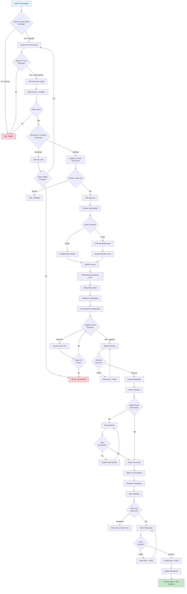
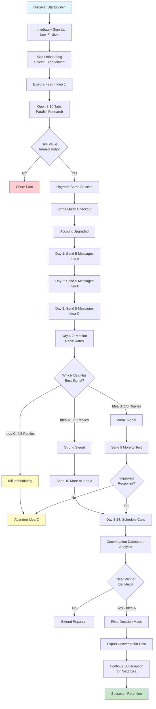
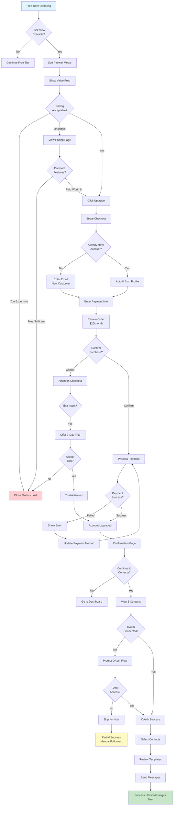
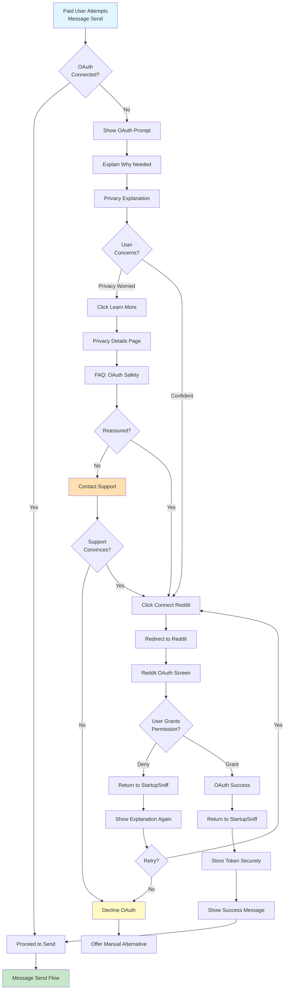
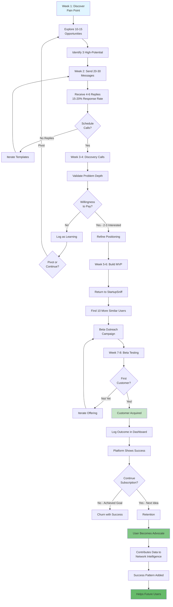

# startup-sniff UX/UI Specification

_Generated on 2025-10-13 by Benjamin_

## Executive Summary

**Project:** StartupSniff - Active Momentum Engine for First-Time Founders

**Vision:** Transform StartupSniff from passive validation platform into an active momentum engine that bridges the catastrophic gap between idea validation and first customer contact. The platform helps anxious first-time founders compress weeks of customer discovery into hours through a guided, low-friction workflow.

**Platform Type:** Web Application (SaaS)
**Project Level:** Level 3 (Full Product)
**Development Timeline:** 14-20 weeks (3 phased epics)
**Target Users:** Anxious first-time founders (primary), Serial experimenters (secondary)

**Three-Pillar Architecture:**

1. **Pillar 1: Magical Reddit Extraction** (Month 1-2, FREE tier)
   - Cross-subreddit pain point aggregation showing commercial viability scores
   - Compresses 10-30 hours of manual browsing into 10 minutes
   - Creates "holy shit moment" earning trust before monetization

2. **Pillar 2: Guided Human Contact Workflow** (Month 3-4, $20/month)
   - Surface 5 real people discussing pain points
   - AI-generated personalized message templates
   - Track conversation outcomes and momentum metrics

3. **Pillar 3: Network Intelligence Foundation** (Month 5-6, Data collection)
   - Anonymized experiment data builds collective intelligence
   - "What worked for others" insights surfaced contextually
   - Defensive data moat through network effects

**UX Complexity:** HIGH
- Multi-step workflows with decision points (discovery → contact → tracking)
- OAuth integration flows (Reddit authentication)
- AI-generated content presentation (scores, templates)
- Real-time data visualization (trends, patterns, social proof)
- Mobile-first responsive design (320px - 1920px)
- Freemium tier management and paywall UX
- Progressive disclosure of complexity for anxious users

**Key UX Challenges:**
- **Emotional Design:** Users arrive anxious, skeptical, seeking permission to act
- **Trust Building:** Must prove value before asking for payment or OAuth access
- **Guided Discovery:** Respect autonomy while encouraging high-value actions
- **Mobile Optimization:** 50%+ traffic from mobile, late-night anxiety sessions
- **Performance as UX:** Speed signals competence, reduces abandonment

**Related Documents:**
- PRD: `/Users/benjamin/Desktop/startup-sniff/docs/PRD.md`
- Epics: `/Users/benjamin/Desktop/startup-sniff/docs/epics.md`
- Product Brief: `/Users/benjamin/Desktop/startup-sniff/docs/product-brief-startup-sniff-2025-10-13.md`

---

## 1. UX Goals and Principles

### 1.1 Target User Personas

**Primary Persona: "Anxious First-Timer" - Sarah**

- **Demographics:** 32 years old, product manager exploring entrepreneurship
- **Experience Level:** First-time founder, lacks customer development skills
- **Psychological State:** Decision paralysis, anxious, skeptical, seeking permission to act
- **Goals:**
  - Validate startup ideas without wasting months
  - Start first customer conversation within 7 days
  - Transition from paralysis to productive momentum
- **Pain Points:**
  - 70.5% lack critical skills (leadership, communication, strategy)
  - 72.7% experience financial anxiety
  - 72% struggle with mental health (37% anxiety, 36% burnout)
  - Spends 10-30 hours/week manually browsing Reddit for pain points
- **Behavior Patterns:**
  - Explores 3-7 ideas before finding product-market fit
  - Returns 2-3 times before paying for features
  - Needs visible momentum metrics for psychological sustenance
  - Mobile usage during commute, lunch breaks, late-night anxiety sessions

**Secondary Persona: "Serial Experimenter" - Marcus**

- **Demographics:** 38 years old, indie hacker with 3 active projects
- **Experience Level:** Experienced founder, technical background
- **Psychological State:** Analytical, time-constrained, seeking efficiency
- **Goals:**
  - Validate multiple ideas simultaneously (portfolio approach)
  - Compress 4-week validation into 10 days
  - Data-driven pivot decisions to optimize time allocation
- **Pain Points:**
  - Opportunity cost of exploring wrong ideas ($10K+ in wasted development)
  - Need faster signal-to-noise ratio for validation
  - Limited time bandwidth (2-3 active projects competing for attention)
- **Behavior Patterns:**
  - Immediate upgrade (low friction tolerance)
  - Batch contact strategy (15 messages across 3 pain points)
  - Leverages advanced insights and network intelligence
  - Willing to pay $50/month for speed and data advantages

### 1.2 Usability Goals

**Goal 1: Minimize Time-to-Value**
- **Target:** "Holy shit moment" within 3 seconds of page load
- **Success Metric:** Average session time >2 minutes, bounce rate <60%
- **UX Approach:** Immediate display of live pain points, no signup walls

**Goal 2: Reduce Friction in Customer Contact Workflow**
- **Target:** Complete message send workflow in <2 minutes
- **Success Metric:** >10% of users who see contacts actually send messages
- **UX Approach:** Streamlined 5-step flow, pre-filled templates, one-click actions

**Goal 3: Build Trust Before Asking for Commitment**
- **Target:** Free tier proves value before paywall or OAuth request
- **Success Metric:** >25% 7-day return rate, >5% free-to-paid conversion
- **UX Approach:** Guided discovery, transparent privacy explanations, social proof

**Goal 4: Mobile-First Excellence**
- **Target:** Full functionality on 320px+ viewports, thumb-reachable actions
- **Success Metric:** Mobile users complete workflows at same rate as desktop
- **UX Approach:** Touch-optimized UI, responsive layouts, PWA capabilities

**Goal 5: Accessibility for All Users**
- **Target:** WCAG 2.1 Level AA compliance
- **Success Metric:** Keyboard navigation, screen reader compatibility, 4.5:1 color contrast
- **UX Approach:** Semantic HTML, ARIA labels, accessible forms

### 1.3 Design Principles

**Principle 1: Guided Discovery Over Forced Compliance**

The interface shall respect user autonomy while gently encouraging high-value actions. Never force workflows or mandatory steps that feel manipulative. Instead, make the right actions so easy and appealing that users choose them voluntarily. Example: Don't hide ideas behind paywall - show them freely, then make contacting humans seamlessly easy for paid tier. Users must feel they're being helped, not herded.

**Rationale:** Anxious founders have low tolerance for perceived manipulation. Trust is earned by proving value before asking for action.

**Principle 2: Immediate "Holy Shit" Moment**

The first screen a user sees must deliver instant value that would be impossible to achieve manually. Within 3 seconds of page load, show live cross-subreddit pain points with commercial viability scores that demonstrate hours of manual work compressed into seconds. No onboarding friction, no signup walls blocking the magic.

**Rationale:** Users arrive skeptical and time-constrained. The platform must earn attention before asking for commitment.

**Principle 3: Progressive Disclosure of Complexity**

Hide advanced features until users need them. Show 3-5 pain points immediately, reveal filters on interaction. Present simple viability scores upfront, expand detailed analysis on click. Message templates appear only when user selects contacts. Each layer of complexity unlocks naturally through exploration, not overwhelming users with options.

**Rationale:** Anxious users suffer from decision paralysis - too many choices freeze action. Start simple, reveal depth gradually.

**Principle 4: Momentum Metrics Over Vanity Metrics**

Display progress indicators that matter psychologically, not just financially: "3 messages sent, 1 reply received, momentum building" instead of focusing solely on revenue. Celebrate small wins (first message sent, first reply) with visual feedback. Make users feel productive even before first customer.

**Rationale:** The gap between validation and revenue causes anxiety. Momentum metrics provide psychological sustenance during the journey.

**Principle 5: Transparency Builds Trust**

Show exactly how AI scores are calculated, why specific humans are surfaced, what data is being collected. Never hide system behavior behind black-box algorithms. Privacy controls must be explicit and easily accessible. When asking for Reddit OAuth, explain clearly why user's own credentials protect them from platform bans.

**Rationale:** Anxious users are inherently skeptical. Transparency converts skepticism into informed confidence.

**Principle 6: Speed as a Feature**

Every interaction should feel instant. Page loads <2s, cross-subreddit searches <5s, message template generation <3s. Use optimistic UI updates, skeleton screens, and progressive loading. Perceived performance matters as much as actual performance - users should never feel like they're waiting.

**Rationale:** Speed signals competence and reduces abandonment. Anxious users interpret slowness as platform problems.

**Principle 7: Social Proof Reduces Friction**

At every decision point, show what others have done: "127 founders explored this pain point, 89 got responses" near contact buttons. Display aggregated success patterns contextually: "Messages sent in morning get 2x replies" when composing. Make users feel part of a community of action-takers, not alone in uncertainty.

**Rationale:** Social proof provides permission to act for users who lack confidence in their own judgment.

**Principle 8: Mobile-First Empathy**

Design for anxious exploration on phones during commutes, lunch breaks, late-night anxiety sessions. Touch targets must be generous (44x44px minimum), critical actions thumb-reachable on one hand. Conversation tracking dashboard optimized for quick check-ins. Users should be able to explore pain points and send messages entirely on mobile without compromise.

**Rationale:** 50%+ of users will access on mobile. Mobile use cases often happen during micro-moments of motivation.

**Principle 9: Contextual Education Over Onboarding**

Don't front-load explanations in lengthy onboarding flows. Instead, deliver micro-education at point of need: tooltip when hovering over viability score explaining methodology, brief video when first encountering message templates. Users learn by doing, not by reading.

**Rationale:** Anxious users skip onboarding to "get to the good stuff" - educate in context when attention is naturally focused.

**Principle 10: Graceful Failure and Recovery**

When things go wrong (API failures, no Reddit results, message send errors), provide clear explanations and actionable next steps. Never show technical error messages - translate into human language with recovery options. If no pain points match search, suggest broadening criteria with one-click options. System should feel helpful even when failing.

**Rationale:** Anxious users interpret errors as personal failure. Graceful handling maintains psychological safety and trust.

---

## 2. Information Architecture

### 2.1 Site Map

```
StartupSniff Application Structure
│
├── 🌐 Public/Marketing (Unauthenticated)
│   ├── Landing Page (/)
│   │   └── Value proposition, live pain point demo, signup CTA
│   ├── Pricing (/pricing)
│   │   └── Free vs. Paid tier comparison, FAQ
│   ├── How It Works (/how-it-works)
│   │   └── Three-pillar explanation, success stories
│   ├── Login (/login)
│   │   └── Email/password, OAuth (Google, GitHub)
│   └── Signup (/signup)
│       └── Registration form, email verification
│
├── 📊 Core Application (Authenticated - Free Tier)
│   │
│   ├── Home/Dashboard (/app or /dashboard)
│   │   ├── Recent pain points explored
│   │   ├── Saved/bookmarked pain points
│   │   ├── Quick stats (if paid: messages sent, replies)
│   │   └── Onboarding checklist (first-time users)
│   │
│   ├── Explore Pain Points (/explore)
│   │   ├── Pain point feed (default view)
│   │   │   ├── Cross-subreddit aggregated list
│   │   │   ├── AI commercial viability scores (1-10)
│   │   │   ├── Trend indicators (↑ ↓ →)
│   │   │   ├── Social proof badges ("127 founders explored this")
│   │   │   └── Filter/sort controls (sidebar or top bar)
│   │   │
│   │   ├── Filters (sidebar/modal on mobile)
│   │   │   ├── By subreddit (multi-select)
│   │   │   ├── By timeframe (24h, 7d, 30d)
│   │   │   ├── By viability score (slider 1-10)
│   │   │   └── By trend status (checkboxes)
│   │   │
│   │   └── Search (keyword full-text search)
│   │
│   └── Pain Point Detail (/explore/[pain-point-id])
│       ├── Full post content + metadata
│       ├── AI analysis breakdown (expandable)
│       ├── Engagement metrics (upvotes, comments)
│       ├── Similar pain points (3-5 recommendations)
│       ├── Comment highlights
│       ├── Social proof ("89 sent messages, 34 got replies")
│       └── CTA: "View 5 people discussing this" (PAYWALL for free users)
│
├── 💬 Human Contact Workflow (Paid Tier Only - $20/month)
│   │
│   ├── Contact Discovery (/contacts/[pain-point-id])
│   │   ├── 5 real Reddit users listed
│   │   ├── Profile previews (username, karma, activity)
│   │   ├── "Why this person?" explanations
│   │   ├── Multi-select checkboxes (select 1-5 contacts)
│   │   └── "Review messages" CTA button
│   │
│   ├── Message Composition (/compose)
│   │   ├── Selected contacts review
│   │   ├── AI-generated templates (editable)
│   │   ├── Template variant selector (Professional, Casual, Concise)
│   │   ├── Character count indicator
│   │   ├── Reddit OAuth status indicator
│   │   └── "Send X messages" button (with rate limit check)
│   │
│   ├── Reddit OAuth Flow (/auth/reddit)
│   │   ├── OAuth consent screen (popup/redirect)
│   │   ├── Privacy explanation
│   │   └── Success/error handling
│   │
│   └── Conversation Tracking (/conversations or /dashboard/messages)
│       ├── Aggregate metrics dashboard
│       │   ├── Messages sent, replies received
│       │   ├── Calls scheduled, customers acquired
│       │   └── Momentum visualization (progress bars, charts)
│       ├── Individual message list
│       │   ├── Sent messages with status
│       │   ├── Manual outcome logging (dropdown per message)
│       │   └── Timeline view (chronological)
│       └── Export conversation log (CSV download)
│
├── 🧠 Network Intelligence (Pillar 3 - Integrated)
│   │
│   ├── Insights Library (/insights)
│   │   ├── Discovered patterns organized by category
│   │   ├── Confidence scores per insight
│   │   ├── Sample sizes and statistical significance
│   │   └── User feedback ("Was this helpful?")
│   │
│   └── Data Contribution Dashboard (/contribution)
│       ├── User's contribution stats
│       ├── Impact visualization ("Helped 500+ founders")
│       ├── Badges/achievements (gamification)
│       └── Opt-in/opt-out controls
│
├── ⚙️ User Settings & Management
│   │
│   ├── Profile (/settings/profile)
│   │   ├── Name, email, password change
│   │   ├── Experience level, goals
│   │   └── Avatar/photo (optional)
│   │
│   ├── Subscription (/settings/subscription)
│   │   ├── Current plan (Free/Paid/Enterprise)
│   │   ├── Upgrade/downgrade options
│   │   ├── Billing history
│   │   └── Stripe customer portal link
│   │
│   ├── Connected Accounts (/settings/accounts)
│   │   ├── Reddit OAuth status (connected/disconnected)
│   │   ├── Google/GitHub OAuth
│   │   └── Disconnect options with confirmations
│   │
│   ├── Privacy & Data (/settings/privacy)
│   │   ├── Data collection opt-in/opt-out
│   │   ├── Export personal data (GDPR)
│   │   ├── Delete account (with confirmation)
│   │   └── Privacy policy link
│   │
│   └── Notifications (/settings/notifications)
│       ├── Email preferences (toggle per type)
│       └── In-app notification settings
│
└── 📄 Legal & Support
    ├── Privacy Policy (/privacy)
    ├── Terms of Service (/terms)
    ├── Contact Support (/support)
    └── FAQ (/faq)
```

**Total Page Count:** ~25-30 unique views/screens
**Primary Navigation Pages:** 5-7 (Home, Explore, Conversations, Insights, Settings)
**Deep-Linked Pages:** 15-20 (detail views, subpages, modals)

### 2.2 Navigation Structure

**Primary Navigation (Authenticated Users)**

Top navigation bar present on all authenticated pages:

```
┌────────────────────────────────────────────────────────────────────┐
│ [Logo] StartupSniff    Explore  Conversations*  Insights  Settings │
│                                                    [Avatar] [Logout] │
└────────────────────────────────────────────────────────────────────┘

* "Conversations" only visible for paid tier users
  Free tier users see upgrade badge/indicator
```

**Navigation Items:**

1. **Logo/Home** - Returns to dashboard/explore
2. **Explore** - Pain point discovery (FREE tier access)
3. **Conversations** - Message tracking dashboard (PAID tier only)
   - Shows upgrade badge for free users
4. **Insights** - Network intelligence library (visible to all, advanced features paid)
5. **Settings** - Dropdown/slide-out menu with:
   - Profile
   - Subscription
   - Connected Accounts
   - Privacy & Data
   - Notifications
6. **Avatar/User Menu** - Quick access to:
   - Account settings
   - Logout
   - Upgrade (if free tier)

**Mobile Navigation Strategy**

Mobile (< 768px):
- Hamburger menu (top-left) OR bottom tab bar
- Primary tabs: Explore | Conversations* | Insights | Settings
- Logo center-top or left-top
- User avatar top-right

**Bottom Tab Bar Option (Mobile-First Approach):**

```
┌─────────────────────────────────────────────────┐
│                   Content                       │
│                                                 │
│                                                 │
└─────────────────────────────────────────────────┘
┌────────┬────────┬────────┬────────┬────────────┐
│ Explore│ Convos*│Insights│Settings│     Menu   │
└────────┴────────┴────────┴────────┴────────────┘
```

**Breadcrumb Structure**

For deep navigation, breadcrumbs appear below top nav:

- `Explore > Productivity Pain Points > Detail`
- `Conversations > Message to u/username > Edit`
- `Settings > Privacy & Data`

**Secondary Navigation Patterns**

**Within Explore:**
- Filters: Collapsible sidebar (desktop) or slide-out panel (mobile)
- Sort: Dropdown in top-right (Recent, Trending, Highest Score)
- Search: Persistent search bar in page header

**Within Conversation Tracking:**
- Tabs: Overview | All Messages | Outcomes
- Filters: By status (Sent, Replied, Call Scheduled, Customer)

**Within Insights:**
- Categories: Sidebar navigation by insight type
  - Response Rates by Subreddit
  - Timing Patterns
  - Template Effectiveness
  - Success Sequences

**Paywall Navigation Handling**

Free tier users attempting to access paid features:

1. **Soft Block:** "View contacts" button shows but triggers upgrade modal
2. **Upgrade Modal:** Contextual value proposition, pricing, one-click upgrade
3. **Navigation Badge:** "Pro" badge next to Conversations tab
4. **Persistent Upgrade CTA:** Non-intrusive banner in dashboard

**Quick Actions / Shortcuts**

- **Keyboard shortcuts:**
  - `/` - Focus search
  - `E` - Go to Explore
  - `C` - Go to Conversations (if paid)
  - `?` - Show keyboard shortcuts help
- **Mobile gestures:**
  - Swipe left/right between primary tabs
  - Pull-to-refresh on Explore feed
  - Long-press pain point for quick actions (bookmark, share)

**Context-Aware Navigation**

- **First-time users:** Onboarding checklist in dashboard with progress
- **Free users exploring detail:** Upgrade CTA appears after 3-5 pain points viewed
- **Paid users post-message:** "Check conversation status" prompt after 24 hours

---

## 3. User Flows

### Flow 1: First-Time User - Discovery to First Message (Epic 1 → Epic 2)

**User Goal:** Anxious first-timer discovers StartupSniff, validates the platform provides value, upgrades to paid tier, and sends first customer outreach message.

**Entry Points:**
- Google search "validate startup idea"
- r/SaaS post recommendation
- IndieHackers mention
- Product Hunt launch

**Success Criteria:** User sends first message within 7 days of discovery



**Decision Points:**
- **Bounce risk:** If no "holy shit moment" within 60s → Failed
- **Conversion moment:** After exploring 3-5 pain points, signup prompt appears
- **Paywall encounter:** Soft block on "View contacts" with upgrade modal
- **OAuth friction:** Transparent explanation reduces drop-off
- **Rate limit:** 5 messages/day clearly communicated upfront

**Error States:**
- Payment failure: Clear error message + retry option + support link
- OAuth denial: Explain why needed, option to proceed without (manual contact)
- Send failure: Retry with exponential backoff, show queue status
- No contacts found: Suggest broader search, different pain point

---

### Flow 2: Serial Experimenter - Rapid Portfolio Validation

**User Goal:** Experienced founder validates 3 ideas simultaneously in 2 weeks using batch strategy.

**Entry Points:**
- IndieHackers recommendation
- Direct signup from competitor comparison

**Success Criteria:** Clear pivot decision within 10-14 days based on response data



**Decision Points:**
- **Immediate value assessment:** Experienced users decide fast (<5 min)
- **Batch strategy:** Uses rate limit strategically (5/day across 3 days)
- **Data-driven pivot:** Response rate differential (60% vs. 20% vs. 0%) drives decision
- **Retention driver:** Success with one idea leads to using platform for next validation

**Key Differentiators for This Persona:**
- Skips onboarding, goes straight to value
- Opens multiple tabs, parallel processing
- Leverages network intelligence insights heavily
- Exports data for offline analysis
- Higher ARPU potential ($50/month enterprise tier)

---

### Flow 3: Free-to-Paid Conversion Flow (Paywall UX)

**User Goal:** Free tier user encounters value, decides to upgrade for human contact features.

**Entry Points:**
- Clicked "View contacts" on pain point detail page
- Navigated to Conversations tab (shows upgrade prompt)
- Dashboard upgrade banner click

**Success Criteria:** User completes upgrade and sends first message within same session



**Conversion Optimization Points:**

1. **Contextual Value Prop:** Modal shows exactly what user gets (5 contacts for THIS pain point)
2. **Social Proof:** "89 founders sent messages from this pain point, 34 got replies"
3. **Risk Reduction:** "Cancel anytime, no long-term commitment"
4. **Trial Consideration:** Exit intent triggers 7-day trial offer
5. **Seamless Onboarding:** After payment, immediate access to blocked feature

**Friction Reducers:**
- Pre-filled email from user profile
- One-click payment with saved methods (returning users)
- Skip trial if user ready to commit
- Clear "What happens next" messaging post-purchase

**Abandonment Recovery:**
- Exit intent: 7-day trial offer
- Email follow-up (24h): "Still interested? Here's what you're missing"
- In-app reminder: "You explored X pain points. Ready to contact people?"

---

### Flow 4: Reddit OAuth Connection (Trust Building)

**User Goal:** Paid user needs to connect Reddit account to send messages, but concerned about privacy/security.

**Entry Points:**
- First message send attempt (OAuth required)
- Settings → Connected Accounts
- Prompt after upgrade completion

**Success Criteria:** User grants OAuth permission with informed confidence



**Trust-Building Elements:**

1. **Transparent Explanation:**
   - "Why your own Reddit account? Distributed sending prevents platform bans"
   - "StartupSniff never sees your password, only send message permission"

2. **Privacy Assurances:**
   - "Your credentials are encrypted at rest (AES-256)"
   - "We can't read your DMs, only send messages you approve"
   - Link to privacy policy section on OAuth

3. **User Control:**
   - Disconnect option always visible in settings
   - Clear permissions list (what app CAN and CANNOT do)
   - Revoke access anytime

4. **Social Proof:**
   - "1,247 founders have safely connected their Reddit accounts"
   - Security badge/certification display

**Error Handling:**
- OAuth denial: Clear explanation of what happens next
- Token expiration: Automatic refresh with user notification
- Reddit downtime: Queue messages, retry automatically

---

### Flow 5: First Customer Acquisition (Complete Success Cycle)

**User Goal:** User goes from pain point discovery to closing first paying customer using StartupSniff.

**Timeline:** 8 weeks (compressed from industry standard 4-6 months)

**Success Criteria:** First revenue generated, user attributes success to StartupSniff, becomes platform advocate



**Platform Contribution Loop:**

1. **Success Logging:** User marks conversation as "Customer Acquired"
2. **Data Anonymization:** Success pattern stripped of PII
3. **Intelligence Building:** Pattern added to collective knowledge
   - "87% of founders in SaaS category got first customer within 90 days"
   - "r/entrepreneur: 18% response rate for problem-first messaging"
4. **Future User Benefit:** Next founder sees these insights
5. **Virtuous Cycle:** More successes → Better predictions → Higher success rate

**Retention Drivers:**
- User achieved goal (first customer) using platform
- Positive association with StartupSniff
- Now wants to validate next idea using same workflow
- Becomes evangelist, refers other founders

**Success Metrics Tracked:**
- Time to first customer: 60 days (vs. industry 120+ days)
- Conversations started: 25
- Response rate: 18%
- Calls scheduled: 5
- Customer acquired: 1
- ROI: $500 customer value vs. $80 platform investment (2 months) = 625% ROI

---

## 4. Component Library and Design System

### 4.1 Design System Approach

**Primary Framework: shadcn/ui + Tailwind CSS**

**Technology Stack:**
- **Base Components:** shadcn/ui (built on Radix UI primitives)
- **Styling:** Tailwind CSS v3+ with custom configuration
- **Framework:** Next.js 14+ with React Server Components
- **Typography:** Inter (body), Space Grotesk or Poppins (headings)
- **Icons:** Lucide React (consistent with shadcn/ui ecosystem)
- **Accessibility:** WCAG 2.1 Level AA compliance (built into Radix UI)

**Why shadcn/ui:**
1. **Copy-paste approach** - You own the code, no package dependency bloat
2. **Radix UI foundation** - Accessible by default, keyboard navigation, screen reader support
3. **Tailwind integration** - Rapid prototyping, consistent design tokens
4. **TypeScript-first** - Type safety throughout component library
5. **Customizable** - Easy to adapt to StartupSniff brand
6. **Performance** - Tree-shakeable, only ship what you use
7. **Modern** - Actively maintained, excellent documentation

**Setup Instructions:**

```bash
# Initialize shadcn/ui in Next.js project
npx shadcn-ui@latest init

# Install core components needed (see 4.2 below)
npx shadcn-ui@latest add button
npx shadcn-ui@latest add card
npx shadcn-ui@latest add input
npx shadcn-ui@latest add dialog
npx shadcn-ui@latest add dropdown-menu
npx shadcn-ui@latest add select
npx shadcn-ui@latest add tabs
npx shadcn-ui@latest add badge
npx shadcn-ui@latest add avatar
npx shadcn-ui@latest add checkbox
npx shadcn-ui@latest add slider
npx shadcn-ui@latest add tooltip
npx shadcn-ui@latest add progress
npx shadcn-ui@latest add skeleton
```

**Tailwind Configuration:**

Custom design tokens defined in `tailwind.config.js`:

```javascript
// StartupSniff custom theme
module.exports = {
  theme: {
    extend: {
      colors: {
        // Primary brand colors
        primary: {
          50: '#eff6ff',
          100: '#dbeafe',
          500: '#3b82f6', // Primary blue
          600: '#2563eb',
          700: '#1d4ed8',
        },
        // Success (for positive signals, high scores)
        success: {
          50: '#f0fdf4',
          500: '#22c55e',
          700: '#15803d',
        },
        // Warning (for medium scores, pending states)
        warning: {
          50: '#fefce8',
          500: '#eab308',
          700: '#a16207',
        },
        // Danger (for low scores, errors)
        danger: {
          50: '#fef2f2',
          500: '#ef4444',
          700: '#b91c1c',
        },
        // Neutral grays
        neutral: {
          50: '#fafafa',
          100: '#f5f5f5',
          200: '#e5e5e5',
          300: '#d4d4d4',
          500: '#737373',
          700: '#404040',
          900: '#171717',
        },
      },
      fontFamily: {
        sans: ['Inter', 'system-ui', 'sans-serif'],
        display: ['Space Grotesk', 'Inter', 'sans-serif'],
      },
      spacing: {
        18: '4.5rem',
        88: '22rem',
        128: '32rem',
      },
      borderRadius: {
        '4xl': '2rem',
      },
    },
  },
};
```

**Component Customization Strategy:**

1. **Use shadcn/ui defaults** for standard UI elements (buttons, inputs, modals)
2. **Create custom variants** for domain-specific needs:
   - Pain Point Card (custom composite component)
   - Commercial Viability Score Badge (custom)
   - Conversation Tracker (custom composite)
   - Message Template Editor (custom)
3. **Extend with Tailwind utilities** for rapid iteration
4. **Maintain consistency** through design tokens and naming conventions

**File Organization:**

```
src/
├── components/
│   ├── ui/              # shadcn/ui base components
│   │   ├── button.tsx
│   │   ├── card.tsx
│   │   ├── dialog.tsx
│   │   └── ...
│   ├── domain/          # Custom StartupSniff components
│   │   ├── pain-point-card.tsx
│   │   ├── viability-score-badge.tsx
│   │   ├── contact-list.tsx
│   │   ├── message-composer.tsx
│   │   └── conversation-tracker.tsx
│   └── layout/          # Layout components
│       ├── nav-bar.tsx
│       ├── sidebar.tsx
│       └── mobile-tab-bar.tsx
├── lib/
│   └── utils.ts         # cn() helper and utilities
└── styles/
    └── globals.css      # Tailwind directives + custom CSS
```

### 4.2 Core Components

**Base UI Components (from shadcn/ui)**

**1. Button Component**
- **Purpose:** Primary interaction element across all features
- **Variants:**
  - `default` - Primary blue, high contrast (CTA actions: "Upgrade", "Send Messages")
  - `secondary` - Gray outline, subtle (secondary actions: "Cancel", "Skip")
  - `outline` - Bordered, no fill (tertiary actions: "Learn More")
  - `ghost` - No background, minimal (navigation, close buttons)
  - `destructive` - Red, dangerous actions ("Delete Account")
  - `link` - Styled as link, no button appearance
- **Sizes:** `sm` (32px height), `default` (40px), `lg` (48px), `icon` (40x40px square)
- **States:** default, hover, active, disabled, loading (with spinner)
- **Mobile:** Minimum 44x44px tap target, increased padding
- **Usage Guidelines:**
  - Primary button: 1 per screen (e.g., "Send Messages")
  - Secondary: supporting actions
  - Always show loading state for async operations

**2. Card Component**
- **Purpose:** Container for pain points, insights, conversation items
- **Variants:**
  - `default` - White background, subtle shadow
  - `elevated` - Stronger shadow for importance
  - `outline` - Bordered, no shadow
  - `interactive` - Hover effects, clickable
- **States:** default, hover (lift effect), active, disabled
- **Composition:** Header, Content, Footer sections
- **Usage Guidelines:**
  - Pain point cards: interactive variant with hover lift
  - Insight cards: elevated variant for emphasis
  - Conversation items: default variant in list

**3. Input Component**
- **Purpose:** Text entry for search, email, password, message editing
- **Variants:**
  - `default` - Standard text input
  - `search` - With search icon prefix
  - `password` - With show/hide toggle
- **States:** default, focus, error, disabled, valid (green border)
- **Features:**
  - Label + helper text support
  - Error message display below
  - Character count indicator (for message composition)
  - Autofocus support
- **Accessibility:** Proper ARIA labels, error announcements
- **Mobile:** 16px font size minimum (prevents iOS zoom)

**4. Dialog/Modal Component**
- **Purpose:** Paywall prompts, OAuth explanations, confirmations
- **Variants:**
  - `default` - Center modal with overlay
  - `drawer` - Slide from bottom (mobile)
  - `alert` - Confirmation dialogs
- **Features:**
  - Backdrop overlay (dim background)
  - Close button (X) in top-right
  - Keyboard support (ESC to close)
  - Focus trap (accessibility)
  - Scroll lock on body
- **Usage Guidelines:**
  - Paywall modal: Show value prop + pricing + CTA
  - OAuth modal: Transparent explanation + trust signals
  - Confirmation: Destructive actions (delete, disconnect)
  - Mobile: Full-screen or slide-up drawer

**5. Badge Component**
- **Purpose:** Status indicators, tier labels, trend arrows
- **Variants:**
  - `default` - Neutral gray
  - `success` - Green (high scores 8-10, trending up)
  - `warning` - Yellow (medium scores 5-7, stable trend)
  - `danger` - Red (low scores 1-4, trending down)
  - `pro` - Blue with gradient (paid tier indicator)
- **Sizes:** `sm`, `default`, `lg`
- **Usage Guidelines:**
  - Commercial viability scores: Color-coded by value
  - Trend indicators: Arrow icon + color
  - Tier badges: "Free" (gray) vs. "Pro" (blue gradient)

**6. Dropdown Menu Component**
- **Purpose:** User menu, filter selectors, action menus
- **Features:**
  - Keyboard navigation (arrow keys)
  - Sub-menu support (nested dropdowns)
  - Icons + labels
  - Dividers for grouping
- **Usage Guidelines:**
  - User avatar menu: Profile, Settings, Logout
  - Pain point actions: Bookmark, Share, View Details
  - Filter menus: Multi-select with checkboxes

**Custom Domain Components (Built on shadcn/ui Base)**

**7. Pain Point Card Component**
- **Purpose:** Display aggregated Reddit pain point with metadata
- **Composition:**
  - Header: Subreddit badge + timestamp
  - Title: Post title (truncated to 2 lines)
  - Excerpt: First 120 characters of post content
  - Metadata row: Upvotes, comments, trend indicator
  - Commercial Viability Score: Large badge (1-10)
  - Social proof: "127 founders explored this"
  - Footer: CTA button "View Details" or "View Contacts" (paid)
- **Variants:**
  - `list` - Compact for feed view
  - `featured` - Larger, more prominence
  - `skeleton` - Loading state with shimmer effect
- **States:** default, hover (lift + border glow), active, bookmarked (star icon)
- **Responsive:**
  - Desktop: Grid layout, 3 columns
  - Tablet: 2 columns
  - Mobile: Single column, full width

**8. Commercial Viability Score Badge Component**
- **Purpose:** Display AI-generated score with visual prominence
- **Design:**
  - Large number (1-10) in bold
  - Color-coded background:
    - 8-10: Green gradient
    - 5-7: Yellow/orange gradient
    - 1-4: Red gradient
  - Small "Viability Score" label below
  - Tooltip on hover: Explanation of score factors
- **Sizes:** `compact` (small badge in cards), `large` (detail view)
- **Accessibility:** ARIA label with full explanation

**9. Contact Discovery List Component**
- **Purpose:** Display 5 Reddit users for outreach (paid feature)
- **Composition Per Contact:**
  - Avatar (Reddit default avatar or custom)
  - Username (u/username)
  - Profile stats: Karma, account age
  - Recent post excerpt (why this person)
  - "Why this person?" explanation text
  - Checkbox for multi-select
- **Features:**
  - Multi-select (1-5 contacts)
  - "Select all" / "Select none" buttons
  - "Refresh" to see different 5 contacts
  - Empty state: "No recent contacts found, try different pain point"
- **Responsive:**
  - Desktop: List with checkboxes left
  - Mobile: Cards with larger tap targets

**10. Message Composer Component**
- **Purpose:** Review and edit AI-generated templates before sending
- **Composition:**
  - Selected contacts summary (3 of 5 selected)
  - Template variant selector: Radio buttons (Professional, Casual, Concise)
  - Editable textarea with AI-generated template
  - Character count indicator (150-250 words recommended)
  - Preview mode toggle
  - Rate limit indicator: "3 of 5 messages remaining today"
  - Send button (primary, large)
- **Features:**
  - Live template regeneration on variant change
  - Syntax highlighting for personalization tokens
  - Autosave draft (localStorage)
  - Mobile: Full-screen composer for focus
- **States:** editing, generating (loading), sending (disabled), sent (success)

**11. Conversation Tracker Dashboard Component**
- **Purpose:** Display momentum metrics and message outcomes
- **Composition:**
  - Aggregate metrics cards:
    - Messages Sent (count + trend)
    - Replies Received (count + % rate)
    - Calls Scheduled (count)
    - Customers Acquired (count)
  - Visualization: Progress bars or simple bar chart
  - Message list table:
    - Columns: Recipient, Pain Point, Sent Date, Status, Outcome
    - Actions: Log outcome (dropdown)
  - Export button: Download CSV
- **Features:**
  - Manual outcome logging per message
  - Filter by status (Sent, Replied, Call Scheduled, Customer)
  - Sort by date
  - Empty state: "Send your first message to start tracking"
- **Responsive:**
  - Desktop: Table view with all columns
  - Mobile: Card view, swipeable

**12. Trend Indicator Component**
- **Purpose:** Show pain point trend direction and velocity
- **Design:**
  - Arrow icon: ↑ (trending up), ↓ (trending down), → (stable)
  - Color: Green (up), red (down), gray (stable)
  - Percentage change: "+23%" or "-12%"
  - Tooltip: "Mentioned 47 times this week vs. 38 last week"
- **Sizes:** `sm` (in cards), `lg` (in detail view)

**13. Social Proof Badge Component**
- **Purpose:** Display aggregated experiment data to build confidence
- **Design:**
  - Icon (user group icon)
  - Text: "127 founders explored this, 89 got responses"
  - Color: Subtle blue or gray
  - Placement: Below pain point title or near CTA
- **Variants:**
  - `inline` - Single line, compact
  - `stacked` - Multi-line with metrics breakdown
- **Conditional Display:** Only show if sample size >10

**14. Loading Skeleton Components**
- **Purpose:** Show content is loading without blocking UI
- **Variants:**
  - Pain point card skeleton (shimmer effect)
  - Contact list skeleton
  - Dashboard metrics skeleton
- **Design:** Gray rectangles with subtle shimmer animation
- **Usage:** Replace actual content during API calls

**15. Empty State Component**
- **Purpose:** Guide users when no content available
- **Variants:**
  - No pain points found: "Try broadening your filters"
  - No conversations yet: "Send your first message to start tracking"
  - No insights available: "Insights unlock after 500+ experiments"
- **Design:**
  - Icon (relevant to context)
  - Heading (clear explanation)
  - Subtext (what to do next)
  - CTA button (action to take)

**Component Naming Convention:**

- Use PascalCase: `PainPointCard`, `MessageComposer`
- Suffix with type: `ViabilityScoreBadge`, `ConversationDashboard`
- Variants as props: `<Button variant="primary" size="lg" />`

**Accessibility Requirements (All Components):**

- ✅ Keyboard navigation (Tab, Enter, Escape)
- ✅ ARIA labels and roles
- ✅ Focus indicators (visible outline)
- ✅ Screen reader announcements for state changes
- ✅ Color contrast 4.5:1 minimum (WCAG AA)
- ✅ Touch targets 44x44px minimum (mobile)
- ✅ Error messages associated with form fields

**Performance Considerations:**

- Lazy load components below the fold
- Code-split domain components by route
- Memoize expensive renders (React.memo)
- Virtualize long lists (pain points feed, message list)
- Optimize images (WebP, lazy loading, responsive srcset)

---

## 5. Visual Design Foundation

### 5.1 Color Palette

**Primary Brand Colors**

- **Primary Blue:** `#3b82f6` (rgb(59, 130, 246))
  - Use: Primary CTAs, links, active states, brand elements
  - Shades: 50, 100, 500 (primary), 600, 700
  - Accessibility: Passes WCAG AA on white background

- **Success Green:** `#22c55e` (rgb(34, 197, 94))
  - Use: High viability scores (8-10), positive trends, success states
  - Shades: 50 (backgrounds), 500 (primary), 700 (text)

- **Warning Yellow/Orange:** `#eab308` (rgb(234, 179, 8))
  - Use: Medium viability scores (5-7), pending states, cautions
  - Shades: 50, 500, 700

- **Danger Red:** `#ef4444` (rgb(239, 68, 68))
  - Use: Low viability scores (1-4), errors, destructive actions
  - Shades: 50, 500, 700

**Neutral Grays**

- **Gray Scale:** 50, 100, 200, 300, 500, 700, 900
  - Use: Text, borders, backgrounds, disabled states
  - Body text: Gray 900 (#171717)
  - Secondary text: Gray 700 (#404040)
  - Tertiary text: Gray 500 (#737373)
  - Borders: Gray 200 (#e5e5e5)
  - Background: Gray 50 (#fafafa) or White

**Semantic Colors**

- **Info:** Blue 500
- **Success:** Green 500
- **Warning:** Yellow 500
- **Error:** Red 500

### 5.2 Typography

**Font Families:**

- **Primary (Body):** Inter
  - Google Fonts: `https://fonts.google.com/specimen/Inter`
  - Weights: 400 (Regular), 500 (Medium), 600 (Semibold), 700 (Bold)
  - Use: Body text, UI elements, forms, buttons

- **Display (Headings):** Space Grotesk
  - Google Fonts: `https://fonts.google.com/specimen/Space+Grotesk`
  - Weights: 500 (Medium), 600 (Semibold), 700 (Bold)
  - Use: Page headings, hero text, marketing copy
  - Alternative: Poppins if Space Grotesk doesn't fit brand

- **Monospace (Code/Data):** JetBrains Mono or system monospace
  - Use: API responses, technical data, code snippets

**Type Scale:**

- **Heading 1 (Hero):** 48px / 56px line-height, font-weight 700 (Space Grotesk)
  - Mobile: 36px / 42px
  - Use: Landing page hero, major section titles

- **Heading 2 (Page Title):** 36px / 42px, font-weight 700
  - Mobile: 28px / 34px
  - Use: Page titles, main content sections

- **Heading 3 (Section):** 24px / 32px, font-weight 600
  - Mobile: 20px / 28px
  - Use: Card headers, section titles

- **Heading 4 (Subsection):** 20px / 28px, font-weight 600
  - Mobile: 18px / 26px
  - Use: Component titles, smaller sections

- **Body Large:** 18px / 28px, font-weight 400 (Inter)
  - Use: Intro paragraphs, emphasis text

- **Body Regular:** 16px / 24px, font-weight 400
  - **MOBILE MINIMUM:** 16px to prevent iOS zoom
  - Use: Standard body text, descriptions

- **Body Small:** 14px / 20px, font-weight 400
  - Use: Secondary text, metadata, timestamps

- **Caption:** 12px / 16px, font-weight 500
  - Use: Labels, badges, small UI text

- **Button Text:** 16px / 24px, font-weight 600
  - Use: CTA buttons, primary actions

### 5.3 Spacing and Layout

**Spacing Scale (Tailwind defaults + custom):**

- **4px:** `space-1` - Tight spacing (icon padding)
- **8px:** `space-2` - Compact spacing (badge padding)
- **12px:** `space-3` - Small spacing (button padding)
- **16px:** `space-4` - Default spacing (component padding)
- **24px:** `space-6` - Medium spacing (section margins)
- **32px:** `space-8` - Large spacing (card spacing)
- **48px:** `space-12` - XL spacing (section gaps)
- **64px:** `space-16` - 2XL spacing (major sections)
- **72px:** `space-18` (custom) - Page sections
- **96px:** `space-24` - Hero sections

**Layout Grid:**

- **Desktop (>1024px):** 12-column grid, 24px gutter
- **Tablet (768-1023px):** 8-column grid, 16px gutter
- **Mobile (<768px):** 4-column grid, 16px gutter

**Container Widths:**

- **Max content width:** 1280px (centered)
- **Narrow content:** 768px (articles, forms)
- **Wide content:** 1440px (dashboards, tables)

**Card Spacing:**

- Padding: 24px (desktop), 16px (mobile)
- Gap between cards: 24px (desktop), 16px (mobile)
- Border radius: 8px (default), 12px (large cards)

---

## 6. Responsive Design

### 6.1 Breakpoints

Following Tailwind CSS default breakpoints with mobile-first approach:

- **`sm` (640px):** Small tablets, large phones landscape
- **`md` (768px):** Tablets portrait
- **`lg` (1024px):** Tablets landscape, small laptops
- **`xl` (1280px):** Desktops
- **`2xl` (1536px):** Large desktops

**Target Devices:**

- **Primary:** iPhone 12/13/14 (390px), Android equivalents
- **Secondary:** iPad (768px), laptop (1440px)
- **Minimum:** iPhone SE (320px)

### 6.2 Adaptation Patterns

**Navigation**

- **Mobile (<768px):** Bottom tab bar OR hamburger menu
- **Desktop (≥768px):** Horizontal top nav with all items visible

**Pain Point Feed**

- **Mobile:** Single column, full width cards
- **Tablet:** 2-column grid
- **Desktop:** 3-column grid
- **Large Desktop:** 4-column grid (optional)

**Filters**

- **Mobile:** Slide-out panel from left, overlay mode
- **Desktop:** Persistent sidebar, always visible

**Forms/Message Composer**

- **Mobile:** Full-screen modal, focus mode
- **Desktop:** Inline panel or centered modal

**Data Tables (Conversation Tracking)**

- **Mobile:** Card view with swipeable actions
- **Desktop:** Full table with all columns

**Typography Scaling**

- Headings scale down 20-30% on mobile
- Body text remains 16px minimum (prevent iOS zoom)
- Line-height increases slightly on mobile for readability

**Touch Targets**

- **Mobile:** Minimum 44x44px (Apple HIG, WCAG)
- **Desktop:** Minimum 32x32px (can use smaller hover targets)

---

## 7. Accessibility

### 7.1 Compliance Target

**WCAG 2.1 Level AA Compliance**

StartupSniff commits to meeting WCAG 2.1 Level AA standards across all features, ensuring the platform is usable by people with diverse abilities.

### 7.2 Key Requirements

**Perceivable**

- ✅ **Color Contrast:** All text meets 4.5:1 minimum (normal text), 3:1 for large text (18px+)
- ✅ **Alt Text:** All images, icons have descriptive alt attributes
- ✅ **Text Resizing:** Content remains usable at 200% zoom
- ✅ **Color Not Sole Indicator:** Icons + text for status (not just color)

**Operable**

- ✅ **Keyboard Navigation:** All functionality accessible via keyboard (Tab, Enter, Escape, Arrows)
- ✅ **Focus Indicators:** Visible focus outline on all interactive elements (2px blue ring)
- ✅ **No Keyboard Traps:** Users can navigate in and out of all components
- ✅ **Skip Links:** "Skip to main content" link for screen reader users
- ✅ **Touch Targets:** 44x44px minimum on mobile, 32x32px on desktop

**Understandable**

- ✅ **Clear Labels:** All form inputs have associated labels
- ✅ **Error Messages:** Specific, actionable error descriptions
- ✅ **Consistent Navigation:** Navigation order consistent across pages
- ✅ **Plain Language:** Avoid jargon, explain technical terms

**Robust**

- ✅ **Semantic HTML:** Use proper HTML5 elements (nav, main, article, section)
- ✅ **ARIA Labels:** ARIA roles and labels where semantic HTML insufficient
- ✅ **Screen Reader Testing:** Test with VoiceOver (iOS/Mac) and NVDA (Windows)
- ✅ **Valid HTML:** No critical HTML validation errors

**Specific Component Accessibility:**

- **Modals:** Focus trap, ESC to close, return focus on close
- **Dropdowns:** Arrow key navigation, type-ahead search
- **Forms:** Labels, error announcements, validation feedback
- **Buttons:** Loading states announced to screen readers
- **Images:** Decorative images have empty alt="" (hidden from screen readers)

---

## 8. Interaction and Motion

### 8.1 Motion Principles

**Principle 1: Purposeful, Not Decorative**

All animations serve a functional purpose: provide feedback, guide attention, or indicate state changes. No motion purely for decoration.

**Principle 2: Fast and Subtle**

Animations are quick (150-300ms) and subtle. Users should feel snappiness, not waiting. Follow "speed as a feature" design principle.

**Principle 3: Respect User Preferences**

Honor `prefers-reduced-motion` media query. Users who request reduced motion see instant state changes instead of animations.

### 8.2 Key Animations

**Micro-interactions (100-200ms)**

- **Button hover:** Slight brightness increase (5-10% lighter)
- **Button press:** Scale down to 98% on active
- **Card hover:** Lift effect (translate Y -2px, shadow increase)
- **Link hover:** Underline slide-in from left
- **Checkbox/toggle:** Smooth slide/fade transition

**State Transitions (200-300ms)**

- **Modal open/close:** Fade + scale (0.95 → 1.0)
- **Dropdown open:** Fade + slide down 10px
- **Toast notifications:** Slide in from top-right
- **Page transitions:** Fade crossfade (150ms)

**Loading States**

- **Skeleton shimmer:** Continuous subtle shimmer (1.5s loop)
- **Spinner:** Smooth rotation (0.6s ease-in-out)
- **Progress bars:** Smooth fill animation
- **Button loading:** Spinner replaces text, button stays same size

**Success Celebrations (300-500ms)**

- **Message sent:** Checkmark scale + bounce
- **Account upgraded:** Confetti or success icon scale
- **First customer logged:** Brief celebration animation (tasteful)

**Scroll Animations**

- **Parallax (minimal):** Hero background moves slower than content
- **Fade-in on scroll:** Cards fade in as they enter viewport (progressive disclosure)
- **Sticky header:** Smooth transition to compact mode on scroll

**CSS Transitions:**

```css
/* Default transition for most elements */
.transition-base {
  transition: all 200ms cubic-bezier(0.4, 0, 0.2, 1);
}

/* Fast interactions (buttons, links) */
.transition-fast {
  transition: all 150ms ease-out;
}

/* Slower state changes (modals, panels) */
.transition-slow {
  transition: all 300ms ease-in-out;
}
```

**Reduced Motion:**

```css
@media (prefers-reduced-motion: reduce) {
  * {
    animation-duration: 0.01ms !important;
    transition-duration: 0.01ms !important;
  }
}
```

---

## 9. Design Files and Wireframes

### 9.1 Design Files

**Design Tool:** Figma (recommended for collaborative design)

**Figma File Structure (if created):**

- **File:** `StartupSniff - UX Design System`
- **Pages:**
  - Design System (colors, typography, components)
  - Web Screens - Desktop (1440px artboards)
  - Web Screens - Mobile (390px artboards)
  - User Flows (diagrams, journey maps)
  - Prototypes (interactive flows)

**Status:** To be created based on this UX specification

**Alternative Approach:**

Given solo founder constraints, consider AI-assisted design tools:
- **v0.dev** (Vercel) - Generate React components from prompts
- **Lovable.ai** - AI frontend generation
- **Figma AI plugins** - Speed up mockup creation

### 9.2 Key Screen Layouts

**Screen 1: Pain Point Feed (Explore Page) - Desktop**

```
┌─────────────────────────────────────────────────────────────────┐
│ [Logo] StartupSniff    Explore  Insights  Settings   [@] Logout │
├─────────────────────────────────────────────────────────────────┤
│                                                                 │
│  ┌────────────┐  ┌─────────────────────────────────────────┐  │
│  │ FILTERS    │  │ Pain Point Feed                         │  │
│  │            │  │                                         │  │
│  │ Subreddit  │  │  ┌──────┐ ┌──────┐ ┌──────┐          │  │
│  │ ☑ r/SaaS   │  │  │ Card │ │ Card │ │ Card │          │  │
│  │ ☑ r/startup│  │  │  1   │ │  2   │ │  3   │          │  │
│  │ ☐ r/entrep │  │  │ [8/10│ │ [6/10│ │ [9/10│          │  │
│  │            │  │  └──────┘ └──────┘ └──────┘          │  │
│  │ Score: 5-10│  │                                         │  │
│  │ ●━━━━━━━○  │  │  ┌──────┐ ┌──────┐ ┌──────┐          │  │
│  │            │  │  │ Card │ │ Card │ │ Card │          │  │
│  │ Timeframe  │  │  │  4   │ │  5   │ │  6   │          │  │
│  │ ⦿ 7 days   │  │  │ [7/10│ │ [5/10│ │ [8/10│          │  │
│  │ ○ 30 days  │  │  └──────┘ └──────┘ └──────┘          │  │
│  │            │  │                                         │  │
│  └────────────┘  └─────────────────────────────────────────┘  │
│                                                                 │
└─────────────────────────────────────────────────────────────────┘
```

**Screen 2: Message Composer - Mobile**

```
┌───────────────────────┐
│ ← Compose Message     │
├───────────────────────┤
│ Sending to 3 contacts │
│ • u/username1         │
│ • u/username2         │
│ • u/username3         │
├───────────────────────┤
│ Template:             │
│ ⦿ Professional        │
│ ○ Casual   ○ Concise  │
├───────────────────────┤
│ ┌───────────────────┐ │
│ │ Hi [name],        │ │
│ │                   │ │
│ │ I saw your post...│ │
│ │                   │ │
│ │ [editable text]   │ │
│ │                   │ │
│ └───────────────────┘ │
│ 187 characters        │
├───────────────────────┤
│ 3 of 5 messages today │
│ [███░░] Rate limit    │
├───────────────────────┤
│  [ Send 3 Messages ]  │
└───────────────────────┘
```

**Screen 3: Paywall Modal**

```
┌─────────────────────────────────────────┐
│                     ╳ Close             │
│                                         │
│     🚀 Start Talking to Real People    │
│                                         │
│  You've found a great pain point!      │
│  See 5 people who posted about it      │
│  in the last 48 hours.                 │
│                                         │
│  ✓ AI-generated personalized templates │
│  ✓ Track conversation outcomes         │
│  ✓ Send 5 messages per day             │
│                                         │
│  👥 89 founders sent messages from     │
│     this pain point, 34 got replies    │
│                                         │
│       Only $20/month · Cancel anytime  │
│                                         │
│     [ Upgrade to Pro →  ]              │
│                                         │
│     Not ready? [Continue Free Tier]    │
└─────────────────────────────────────────┘
```

---

## 10. Next Steps

### 10.1 Immediate Actions

**Phase 1: Design Finalization (1-2 weeks)**

1. **Review this UX specification** with stakeholders (if applicable)
2. **Optional: Create high-fidelity mockups in Figma**
   - Focus on 3-5 key screens (Landing, Explore Feed, Message Composer, Dashboard)
   - Can skip if using AI-assisted frontend generation (v0.dev)
3. **Finalize brand colors** if StartupSniff has existing brand guidelines
4. **Select final typography** (confirm Inter + Space Grotesk or adjust)

**Phase 2: Technical Implementation Setup (Week 1-2)**

1. **Initialize Next.js 14+ project** with TypeScript
2. **Set up shadcn/ui + Tailwind CSS** following setup instructions in Section 4.1
3. **Configure Tailwind theme** with custom colors, fonts, spacing
4. **Install base components** from shadcn/ui (see component list)
5. **Set up component folder structure** (ui/, domain/, layout/)

**Phase 3: Component Development (Parallel with Architecture)**

1. **Build base UI components** first (buttons, cards, inputs) - Week 2-3
2. **Create custom domain components** (pain point cards, etc.) - Week 3-5
3. **Implement responsive layouts** and test on multiple devices
4. **Accessibility testing** with keyboard navigation and screen readers
5. **Performance optimization** (lazy loading, code splitting)

**Phase 4: Integration with Backend (After Architecture Complete)**

1. **Connect components to API endpoints** from solution-architecture
2. **Implement state management** (React Context, Zustand, or TanStack Query)
3. **Add loading states** and error handling
4. **Integrate Reddit OAuth flow** following security specifications
5. **Connect Stripe** for subscription management

### 10.2 Design Handoff Checklist

**Documentation Complete**

- [x] User personas defined (2 personas)
- [x] Usability goals documented (5 goals)
- [x] Design principles established (10 principles from PRD)
- [x] Site map and navigation structure complete
- [x] User flows mapped (5 comprehensive flows with Mermaid diagrams)
- [x] Component library defined (15 components with variants and states)
- [x] Design system approach documented (shadcn/ui + Tailwind)
- [x] Color palette specified with semantic colors
- [x] Typography scale and font families defined
- [x] Spacing system documented
- [x] Responsive breakpoints and adaptation patterns defined
- [x] Accessibility requirements (WCAG 2.1 AA) documented
- [x] Motion principles and key animations specified

**Ready for Development**

- [x] Component specifications detailed enough for implementation
- [x] Responsive behavior documented for all key components
- [x] Accessibility requirements clear for developers
- [x] File organization structure provided
- [x] Tailwind configuration code ready to copy
- [x] shadcn/ui installation commands provided

**Next Workflows**

- [ ] **Architecture workflow** (REQUIRED before development) - See PRD Next Steps
- [ ] **Optional: Generate AI Frontend Prompt** for rapid prototyping with v0.dev or Lovable.ai
- [ ] **Optional: Create Figma mockups** for visual design refinement
- [ ] **Development kickoff** after architecture complete

**Ready for Epic 1 Implementation:** YES ✓

This UX specification provides sufficient detail to begin Epic 1 (Magical Reddit Extraction Engine) development once architecture is complete. Custom components for Epic 2 and 3 can be built incrementally as those epics begin.

---

## Appendix

### Related Documents

- PRD: `/Users/benjamin/Desktop/startup-sniff/docs/PRD.md`
- Epics: `/Users/benjamin/Desktop/startup-sniff/docs/epics.md`
- Product Brief: `/Users/benjamin/Desktop/startup-sniff/docs/product-brief-startup-sniff-2025-10-13.md`
- Project Workflow Analysis: `/Users/benjamin/Desktop/startup-sniff/docs/project-workflow-analysis.md`

### Version History

| Date       | Version | Changes               | Author   |
| ---------- | ------- | --------------------- | -------- |
| 2025-10-13 | 1.0     | Initial specification | Benjamin |

---

**UX Specification Status: COMPLETE**

This UX specification is ready for handoff to development team or solo implementation. All sections complete with actionable details for Epic 1-3 development.

---

## Appendix

### Related Documents

- PRD: `/Users/benjamin/Desktop/startup-sniff/docs/PRD.md`
- Epics: `/Users/benjamin/Desktop/startup-sniff/docs/epics.md`
- Product Brief: `/Users/benjamin/Desktop/startup-sniff/docs/product-brief-startup-sniff-2025-10-13.md`

### Version History

| Date       | Version | Changes               | Author   |
| ---------- | ------- | --------------------- | -------- |
| 2025-10-13 | 1.0     | Initial specification | Benjamin |
